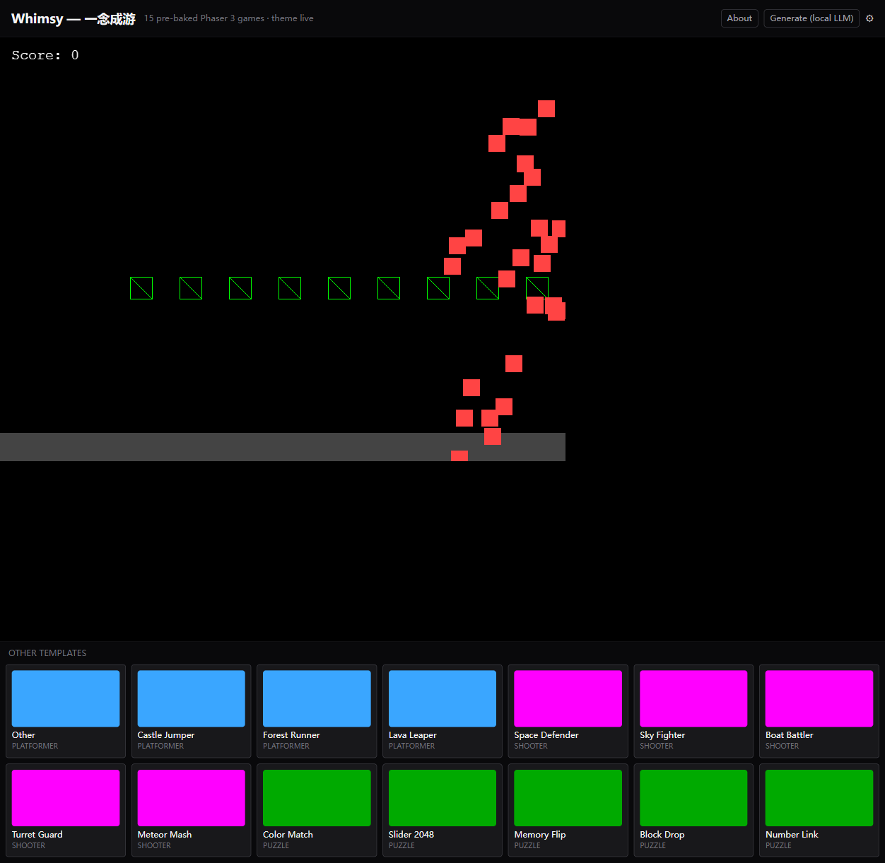

# Whimsy

> One sentence. Five playable Phaser 3 variants in 30 seconds. Pick one, export the source, keep going.

**[English](./README.md) | [简体中文](./README.zh-CN.md)**

[](https://github.com/kevin12369/whimsy/actions/workflows/ci.yml)
[](#embed-anywhere)
[](https://github.com/kevin12369/whimsy/actions/workflows/codeql.yml)
[](#)
[](https://kevin12369.github.io/whimsy/)

<p align="center">
  <a href="https://kevin12369.github.io/whimsy/portfolio"></a>
</p>

A 30s walkthrough lives on the [portfolio page](https://kevin12369.github.io/whimsy/portfolio).

---

## What it is

Whimsy is a Game Jam starter. Describe a game in one sentence (Chinese or English); it gives you five Phaser 3 variants you can actually open and play. Pick the closest one, export the HTML or the Phaser source, and keep iterating in your own editor.

It is not an AI game design tool. It does not invent mechanics for you, balance them, or teach you Phaser. It is a "turn the picture in your head into something I can play in 30 seconds" tool.

## How it works

There are two paths to a playable game:

1. **Templates (no LLM, free).** Fifteen pre-baked Phaser 3 games. Five platformers, five shooters, five puzzles. They are mechanically distinct — `diversity.test.ts` enforces this with a per-template hash check, so you do not get "five platformers that all play like Mario". Click one, it runs.
2. **Generate (LLM, optional).** Describe a game. Whimsy calls an LLM, which returns a small JSON config (8-15 fields: type, colors, labels, and a handful of type-specific numeric parameters). The 5 classic templates (`sideScroller` / `verticalShmup` / `twinStickBattler` / `tileMatch` / `sokoban`) read that config and render a complete Phaser 3 game in the preview iframe. The output goes through a static denylist (11 dangerous APIs), a 200 KB size cap, and an iframe `sandbox="allow-scripts"` (no `allow-same-origin`). If the LLM's response is malformed or missing fields, Whimsy falls back to a random template with safe defaults — you always end up with something that runs.

The LLM is configurable. Cloudflare Workers AI (Llama 3.1 8B) is the default and has a free tier. You can also point it at DeepSeek, Gemini, Anthropic (BYOK), or any local server you have running (Ollama, LM Studio, vLLM, llama.cpp).

## Trying it

The live demo is a portfolio preview. To actually generate from a prompt you need an LLM available somewhere the browser can reach — usually your own machine.

```bash
git clone https://github.com/kevin12369/whimsy
cd whimsy
pnpm install
pnpm dev          # http://localhost:3000
```

A longer walkthrough with screenshots is in [docs/RUN-LOCALLY.md](https://github.com/kevin12369/whimsy/blob/main/docs/RUN-LOCALLY.md). Five steps, about ten minutes.

## Sandbox

LLM output never touches your page directly. The pipeline is:

| Layer | What it does | Where |
|---|---|---|
| Static denylist | 11 dangerous APIs (`eval`, `Function`, `fetch`, `XMLHttpRequest`, `localStorage`, `sessionStorage`, `WebSocket`, `EventSource`, `importScripts`, `window.parent`, `document.cookie`) — any one of them in the HTML and the output is rejected | `packages/sandbox/` |
| Size cap | Anything over 200 KB is rejected. Keeps the iframe cheap to load and limits payload-based abuse | `packages/sandbox/` |
| `sandbox="allow-scripts"` | The iframe runs scripts but has no same-origin access. The host page is unreachable from inside the iframe | embed snippet + `/g/[id]` page |
| CSP meta | `default-src 'none'` plus an explicit allowlist for the Phaser CDN. Blocks any network calls the LLM tries to sneak in | embed snippet + `/g/[id]` page |

If you find a bypass, open an issue with the `sandbox` label. Those are the highest priority. Fixes ship with a regression test.

## The 15 templates

| Genre | ID | Mechanic |
|---|---|---|
| Platformer | `platformer-side-scroller-comet` | Side-scroller, jump, 3 lives |
| Platformer | `platformer-vertical-climber` | Vertical climb, fall = GG |
| Platformer | `platformer-auto-runner` | Auto-run right, tap to jump cacti |
| Platformer | `platformer-single-screen-puzzle` | Single-screen platformer puzzle, reach the top door |
| Platformer | `platformer-double-jump-precision` | Double-jump precision, 8 floating islands, 20s timer |
| Shooter | `shooter-twin-stick-battler` | WASD move, mouse aim |
| Shooter | `shooter-vertical-shmup` | Vertical shmup, auto-fire |
| Shooter | `shooter-bullet-hell` | Fixed position, radial bullets |
| Shooter | `shooter-tower-defense` | Place towers at the bottom, enemies spawn from the top |
| Shooter | `shooter-target-shooting-gallery` | Fixed position, 30 targets, 30s |
| Puzzle | `puzzle-tile-match` | Match same-color tiles, 4x4 board |
| Puzzle | `puzzle-sokoban` | Push boxes to goal squares |
| Puzzle | `puzzle-lights-out` | Click flips self + neighbors, win when all off |
| Puzzle | `puzzle-number-link` | Connect matching numbers without crossing |
| Puzzle | `puzzle-sliding-15` | 15-puzzle sliding tiles |

To add a 16th, see [CONTRIBUTING.md](./CONTRIBUTING.md). The contract is one `Template` object; the diversity test will reject your PR if the new render is a byte-for-byte clone of an existing one.

## Local LLMs

Pointing at a local LLM means the prompt and the generated code never leave your machine. This is the default mode I'd recommend — Cloudflare's free tier is generous but not infinite, and a local 7B coder model is fast enough for a Game Jam starter.

| Backend | Default base URL | Protocol |
|---|---|---|
| [Ollama](https://ollama.com) | `http://localhost:11434` | Ollama native |
| [LM Studio](https://lmstudio.ai) | `http://localhost:1234/v1` | OpenAI compatible |
| [vLLM](https://docs.vllm.ai) | `http://localhost:8000/v1` | OpenAI compatible |
| [llama.cpp](https://github.com/ggerganov/llama.cpp) | `http://localhost:8080/v1` | OpenAI compatible |

Setup:

1. Start one of the above. For Ollama:
   ```bash
   curl -fsSL https://ollama.com/install.sh | sh
   ollama pull llama3.1:8b
   ollama serve
   ```
2. In Whimsy, open **Settings**, pick the **Local LLM** card, choose a provider, set the base URL, type the model name, and click **Test connection**.
3. On the main page, flip the top-right toggle to **Local** before generating.

Models I have actually seen produce working Phaser 3:

- `llama3.1:8b` (Ollama) — about 5 GB RAM, general-purpose
- `qwen2.5-coder:7b` (Ollama) — about 5 GB RAM, strongest code output for the size
- `deepseek-coder-v2:16b` (Ollama) — about 10 GB RAM, strongest overall, needs the hardware

The model field is free text. If you have fine-tuned or quantized a model, use it.

Notes:

- "Local" is not free. It costs CPU/GPU time and electricity. It just costs $0 from Cloudflare's perspective.
- Default timeout is 30 s. For 16B+ models, bump it to 60-120 s in Settings.
- The sandbox runs on local LLM output the same way it runs on cloud output. "I trust it because it's mine" is not a path the code recognizes.
- `baseUrl` is restricted to `http://` and `https://`. `file://` and `ftp://` get a 400 (SSRF protection).

## Embed anywhere

Drop any template into a blog, Notion page, personal site, or another README. Two lines:

```html
<script src="https://kevin12369.github.io/whimsy/whimsy-embed.js"
        integrity="sha384-kqeOzlUXu5dbiku5kz1cVUcZ9LU1CWy2W+tE4+AgnpWhZ3R29c6ravr8xDsQgf8k"
        crossorigin="anonymous"
        defer></script>
<div data-whimsy-template="platformer-side-scroller-comet"
     data-whimsy-theme="#22d3ee"
     data-whimsy-height="600"
     style="width:100%"></div>
```

| Attribute | Required | Notes |
|---|---|---|
| `data-whimsy-template` | yes | Template id, lowercase-hyphenated |
| `data-whimsy-theme` | no | Hex color, overrides template default |
| `data-whimsy-height` | no | iframe height in px, default 600, range 120-1600 |

The snippet replaces each `<div data-whimsy-template="...">` with an `<iframe>` pointing at `/embed/<id>/`. The iframe is `sandbox="allow-scripts"` and the served HTML goes through the same denylist, size cap, and CSP as the main app. The snippet itself does not use `eval`, `new Function`, or remote scripts.

P2 status (2026-06-14): the snippet, the README section, and a four-case vitest (`apps/web/tests/embed.test.tsx` — page shape, CSP wrapper, XSS escape, snippet safety) are shipped. The `/embed/<id>` route currently serves a CSP-hardened placeholder Phaser page. A real server-side fetch that resolves the template id, applies the theme, and reuses the sandbox pipeline is P3.

## Stack

| Layer | Choice |
|---|---|
| Frontend | Next.js 14, Pages Router, `output: 'export'`, basePath `/whimsy` |
| Cloud LLM | Cloudflare Workers AI Llama 3.1 8B (default, free) / DeepSeek / Gemini / Anthropic (BYOK) |
| Local LLM | Ollama native + OpenAI-compatible (LM Studio / vLLM / llama.cpp) |
| Sandbox | 11-API static denylist + 200 KB size cap + CSP meta + iframe `sandbox="allow-scripts"` |
| Retry | Self-iterating state machine, max 2 rounds, template fallback on final failure |
| Deploy | GitHub Pages static export, workflow in `.github/workflows/pages.yml` |
| Tests | vitest (222 cases across 6 packages) + Playwright e2e (CI only) + CodeQL |

5 pure-TS packages (`prompt` / `sandbox` / `llm` / `retry` / `templates`) + 1 app (`web`), pnpm workspace.

## Development

```bash
pnpm install
pnpm dev            # http://localhost:3000
pnpm test           # 222 tests
pnpm --filter @whimsy/web build
```

Deploy: push to `main`, the Pages workflow publishes `apps/web/out/`. Site is `https://kevin12369.github.io/whimsy/`. To deploy elsewhere, run `pnpm --filter @whimsy/web build` and upload `apps/web/out/` to any static host.

## Issues that are useful

- **Generated game does not run / controls broken / crash** — open a bug, paste the prompt and the first 30 lines of output. These are the most actionable reports.
- **Templates feel too similar** — open an issue with the `template` label and name the IDs. The diversity test is a floor, not a ceiling.
- **Sandbox bypass** — `sandbox` label, include a minimal repro. These get fixed first.
- **Want to add a template / provider / genre** — see [CONTRIBUTING.md](./CONTRIBUTING.md). PRs are welcome.
- **Want to say "nice work"** — the `encouragement` label exists for exactly this. Read at the end of every sprint.

Repo: github.com/kevin12369/whimsy
Email: 491750329@qq.com
