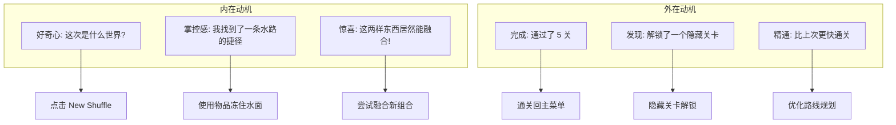

# 奇想洗牌世界 — 游戏设计文档 (GDD)

> **Game Design Document v1.0**
> 2026-06-23 | Author: GameDesigner
> Repository: @whimsy/shuffle

---

## 目录

1. [产品身份](#1-产品身份)
2. [设计支柱](#2-设计支柱)
3. [玩家画像与动机](#3-玩家画像与动机)
4. [核心玩法循环](#4-核心玩法循环)
5. [系统设计规格](#5-系统设计规格)
6. [玩家旅程](#6-玩家旅程)
7. [内容管线](#7-内容管线)
8. [难度曲线与平衡](#8-难度曲线与平衡)
9. [感官设计](#9-感官设计)
10. [制作路线图](#10-制作路线图)
11. [成功指标](#11-成功指标)

---

## 1. 产品身份

### 一句话宣言

> **"每次游戏，世界重新洗牌。"**
> 一个一次性会话驱动的 2D 沙盒探索游戏，每个会话都是独一无二的程序化世界。

### 玩家价值主张

| 维度 | 承诺 |
|------|------|
| **新鲜感** | 每次点击 New Shuffle，你都会获得一个从未见过的世界：新主题、新地牢、新规则、新物品 |
| **探索欲** | 在程序生成的迷宫里漫游，发现隐藏物品、邂逅神秘 NPC、解锁秘密关卡 |
| **实验精神** | 把东西丢进融合祭坛看看会发生什么 — 16+ 种配方等你发现 |
| **低承诺** | 每个会话只需 5 分钟，随开随玩，不绑定账号，不存档，纯粹的游戏 |

### 竞品定位

```
                      ┌ 高学习深度
                          │
                    魂系列         │
                          │
                    │     Roguelike
                    │         (Binding of Isaac)
       ┌───────┼─────────
       │                     │
       │                     │
       │   Whimsy Shuffle    │
  ─────┤    ● (低承诺探索)    │
       │                     │
       │        │      休闲沙盒
       │             (Stardew Valley)
                    │
                      └ 低学习深度
```

### 技术边界（不可变更）

- ✅ 单页浏览器游戏
- ✅ 纯客户端，无后端
- ✅ 单人，无账号
- ✅ 键盘 + 鼠标，不支持触屏
- ✅ 纯程序化 / LLM 增强双模式
- ✅ 部署到 GitHub Pages / itch.io

---

## 2. 设计支柱

> 以下五条是不可妥协的设计原则。**任何设计决策必须通过这五条的检验。**

### 支柱 1: 每次都是新游戏

**原则**: 两次会话之间，玩家不应该感到"又在玩同一关"。

**量化标准**:
- 连续 5 次 New Shuffle，玩家应看到 ≥4 个不同主题
- 每次会话的地图布局、物品分布、出口位置必须不同
- 体验变异性 ≥80%（100 个玩家中至少 80 人说"和上次不一样"）

**设计约束**:
- 禁止任何固定关卡布局
- 禁止任何可预测的物品/出口位置
- 种子变化必须覆盖主题、地图、物品、NPC、规则五个维度

### 支柱 2: 探索即奖励

**原则**: 玩家的每一步移动都应该有发现的可能性。

**量化标准**:
- 每关至少有 6 个交互点（物品/NPC/祭坛）
- 交互点之间的平均距离 ≤8 格
- 玩家走完每关应遇到 ≥3 个可交互内容

**设计约束**:
- 禁止"空旷走廊"（连续 10 格以上无内容的区域）
- 物品/NPC/祭坛的分布必须交错，不能全部扎堆
- 墙壁必须有变化（厚度、密度、形状），不能是单调的直线

### 支柱 3: 简单规则，意外结果

**原则**: 玩家应该能通过简单的操作发现意想不到的玩法。

**量化标准**:
- 融合系统至少有 3 个可发现的"惊喜"配方（第一次看到会 wow）
- 物品使用至少有 2 种非显而易见的用途
- 新玩家在前 3 次会话中应至少有一次意外发现

**设计约束**:
- 禁止"配方书"直接展示所有配方（保留发现惊喜）
- 但 NPC 可以间接提示配方（线索式引导）
- 意外结果不能是惩罚性的（不能做出有害物品）

### 支柱 4: 5 分钟一局的节奏

**原则**: 从按下 New Shuffle 到回到主菜单，应在 5 分钟左右。

**量化标准**:
- 每关平均逗留时间: 45-75 秒
- 每次会话总时间: 4-6 分钟
- 出口应在玩家可见范围内（从出生点能看到出口方向标记）

**设计约束**:
- 单关地图不宜过大（30-50 格宽 × 25-35 格高 已经合理）
- 物品/NPC 的交互时间 ≤5 秒每次
- 融合祭坛的操作不应超过 30 秒
- 玩家不应该感到"这关怎么还没完"

### 支柱 5: 视觉服务于玩法

**原则**: 颜色和形状首先用于传达游戏信息，其次才是美观。

**量化标准**:
- 物品种类颜色编码: 可拾取（暖色） vs 不可交互（冷色）
- 危险区域（水、陷阱）颜色与地面有明显对比
- 出口颜色永不与其他元素混淆（永远是黄色/金色系）

**设计约束**:
- 所有交互元素必须有明确的视觉提示
- 不添加纯装饰性的粒子/特效（除非用于反馈操作）
- 颜色编码必须考虑色盲友好（不单靠颜色区分）

---

## 3. 玩家画像与动机

### 目标玩家

**不一定是游戏玩家** — 可能是开发者、设计师、普通上网者，对"AI 生成"和"每次不同"感兴趣的人。

| 画像 | 描述 | 占比估计 |
|------|------|---------|
| **探索者 (Explorer)** | 喜欢漫无目的地走走看看，意外发现新东西 | 40% |
| **实验者 (Experimenter)** | 想试试"如果 A 和 B 融合会怎样" | 30% |
| **收藏者 (Collector)** | 想集齐所有融合配方或解锁所有隐藏关卡 | 15% |
| **速度跑者 (Speedrunner)** | 想挑战最快通关 5 关 | 10% |
| **观赏者 (Spectator)** | 不开玩，只看看这次生成了什么世界 | 5% |

### 动机映射



### 动机驱动的设计规则

**对于探索者**:
- 每关必须有至少 1 个"隐藏角落"——不绕路就看不到的东西
- 物品不要全部放在主路径上，有些需要"走过去看看"

**对于实验者**:
- 物品行为描述应该暗示可能的用途（"freezes water" 告诉你能冻水）
- 融合失败应该有建设性反馈（"Not quite — try something with similar properties"）

**对于收藏者**:
- 记录已发现/未发现的融合配方（Tier 2+ 功能）
- 隐藏关卡数量显示（"2/5 hidden levels discovered"）

---

## 4. 核心玩法循环

### 4.1 宏观循环 (Macro Loop)

```
┌────────────┐     ┌──────────┐     ┌───────────┐     ┌──────────┐
│ 主菜单     │ ──> │ 会话生成  │ ──> │ 关卡 1-5   │ ──> │ 结果界面  │
│ New Shuffle│     │ 主题+牌组 │     │ 逐一通关   │     │ 统计数据  │
└────────────┘     └──────────┘     └───────────┘     └──────┬───┘
      ▲                                                      │
      └──────────────────── Reshuffle ───────────────────────┘
```

### 4.2 中层循环 (Meso Loop) — 每关

```
                    ┌─────────────────────┐
                    │   进入关卡           │
                    │   地图生成 + 实体放置  │
                    └──────────┬──────────┘
                               │
                               ▼
                    ┌─────────────────────┐
                    │   观察环境           │
                    │   主题? 出口方向?     │
                    │   水/路分布?         │
                    └──────────┬──────────┘
                               │
                    ┌──────────┴──────────┐
                    ▼                     ▼
          ┌─────────────────┐  ┌─────────────────┐
          │ 规划路线          │  │ 探索分支          │
          │ 绕水 → 搜物品     │  │ 绕路捡东西        │
          │ 直奔出口          │  │ 找NPC对话         │
          └────────┬────────┘  └────────┬────────┘
                   │                    │
                   ▼                    ▼
          ┌──────────────────────────────────┐
          │           执行 & 交互               │
          │   ┌───┐ ┌────┐ ┌─────┐ ┌──────┐   │
          │   │E捡│ │Q用│ │E对话│ │E融合 │   │
          │   │物品│ │物品│ │ NPC│ │祭坛  │   │
          │   └───┘ └────┘ └─────┘ └──────┘   │
          └────────────────┬─────────────────┘
                           │
                           ▼
          ┌────────────────────────────────────┐
          │         到达出口 / 完成关卡目标       │
          │   → 前进到下一关                    │
          │   → 最后一关 → 会话结算 → 主菜单     │
          └────────────────────────────────────┘
```

### 4.3 微观循环 (Micro Loop) — 每步操作

```
输入: WASD/方向键  ──>  玩家移动  ──>  AABB碰撞检测
                          │
                    ┌─────┴─────┐
                    │           │
                    ▼           ▼
                正常移动     水格减速(×0.45)
                              │
                          提示 "In water"
```

```
输入: E键  ──>  检查最近的交互对象
                │
    ┌───────────┼───────────┐
    ▼           ▼           ▼
  物品拾取    NPC对话     融合祭坛
  ──> 加入    ──> 显示    ──> 打开
     背包       对话      融合场景
  ──> 动画              ──> 选择卡片
  ──> 漂浮文字          ──> FUSE
```

### 4.4 循环杠杆点分析

| 杠杆 | 当前状态 | 目标状态 | 影响 |
|------|---------|---------|------|
| **前进阻力** | 无（走就行） | 水减速+陷阱 | 迫使玩家思考和规划 |
| **分支激励** | 弱（可捡可不捡） | 物品有用，NPC给线索 | 探索有价值 |
| **目标多样性** | 无（只到出口） | 收集/对话/融合条件出口 | 每关不一样 |
| **风险压力** | 无 | 陷阱掉血 → HP归零重置关卡 | 注意力提升 |
| **正反馈密度** | 每关 1-2 次 | 每关 3-5 次（拾取+对话+使用+融合+到达） | 满足感增强 |

---

## 5. 系统设计规格

### 5.1 健康系统 — `PlayerStatus`

**设计目的**: 引入风险/回报决策，让探索有代价，出口到达有成就感。

```
                 ┌────────┐
                 │ ❤️❤️❤️  │  最大 3 心
                 └───┬────┘
                     │
         ┌───────────┼───────────┐
         ▼           ▼           ▼
     ❤️ 全满       ❤️ 受伤     💀 归零
    (自信探索)   (危险感↑)   (关卡重置)
```

**规格**:

| 属性 | 值 | 理由 |
|------|-----|------|
| 最大 HP | 3 | 容错 2 次不会死，但第 3 次必须小心 |
| 无敌时间 | 1.5 秒 | 防止连伤，给玩家反应时间 |
| 受伤来源 | 陷阱瓦片 | 每个主题有 1 种特色陷阱 |
| 死亡惩罚 | 当前关卡重置（回到出生点，HP 回满，物品保留） | 避免挫败感太强 |
| 治疗来源 | rose potion（使用后回 1HP） | 物品变得有用 |

**陷阱瓦片映射（每个主题 1 种）**:

| 主题 | 陷阱类型 | 视觉编码 |
|------|---------|---------|
| Forest | 荆棘丛 (thorns) | 深红色瓦片 |
| Ocean | 暗流 (riptide) | 深蓝色漩涡瓦片 |
| Dungeon | 尖刺 (spikes) | 灰色三角形 |
| Sci-Fi | 能量场 (energy field) | 闪烁的紫色 |
| Desert | 流沙 (quicksand) | 深黄色漩涡 |
| Tundra | 冰裂缝 (ice crack) | 白色裂痕 |
| Jungle | 毒藤 (poison vine) | 深绿色条纹 |
| Crystal | 水晶尖刺 (crystal shard) | 粉色尖端 |
| Neon | 电击 (electrified) | 蓝色电弧 |
| Haunted | 亡灵之手 (ghostly hand) | 半透明灰色 |
| Sky | 气流空洞 (air void) | 白色漩涡 |

### 5.2 物品使用系统 — `ItemUseEffects`

**设计目的**: 给背包里的物品实际用途，让"捡起来"不等于"收藏品"。

```
拾取物品 → 背包 → 遇到合适场景 → Q键使用 → 物品消耗 → 场景改变
                  │
           ┌──────┴──────┐
           ▼             ▼
      冻结水面        照亮路线
      清除障碍        恢复生命
```

**当前已实现的物品效果**:

| 物品 | 效果 | 场景 |
|------|------|------|
| brine comet | 冻结半径 2 内的所有水格 | 需要通行水路 |
| frost splinter | 冻结半径 2 内的所有水格 | 同上 |
| cyan blade | 清理 7×3 矩形内的水格 | 开辟水路通道 |
| ferment orb | 固化半径 3 内的所有水格 | 大面积通行 |
| rose potion | 恢复 1HP | 受伤后治疗 |

**扩展规则 (Tier 2)**:
- 每个物品使用后会消耗（从背包移除）
- 效果应该与环境有视觉反馈（冻结动画、清除波纹）

### 5.3 NPC 系统升级

**设计目的**: NPC 从"会说话的装饰"变为"有价值的信息节点"。

```
当前: NPC → 固定台词 → 无后续作用
目标: NPC → 世界风味 → 融合线索 → (可选) 任务给予
```

**对话优先级**:
1. 专属台词（角色特定的 3-5 句）
2. 世界风味台词（当前主题的环境描述）
3. 融合线索台词（根据当前物品池提示配方）
4. 回退台词（循环使用已有台词）

**扩展规则 (Tier 2 — NPC 任务)**:
- 每个 NPC 有一个随机请求物品
- 玩家交付 → NPC 回报一个融合配方线索
- 任务可选，但不做就少一个线索

### 5.4 关卡目标变体

**设计目的**: 5 关如果每关都一样，玩到第 3 关就会无聊。让每关有不同的"赢条件"。

| 关卡 | 默认条件 | 变体 A | 变体 B |
|------|---------|--------|--------|
| L1 (新手) | 到达出口 | — | — |
| L2 (收集) | 到达出口 | **收集 2 个物品后出口开启** | **到达出口 + 不少于 2 个物品** |
| L3 (交互) | 到达出口 | **与所有 NPC 对话后出口开启** | **路过陷阱区 (至少触发 1 次)** |
| L4 (融合) | 到达出口 | **融合至少 1 次后出口开启** | **到达出口 + 使用物品 1 次** |
| L5 (综合) | 到达出口 | **完成前面任意 2 个额外目标** | **到达出口 + HP ≥ 1** |

**实现方式**: 在 WorldState 中添加 levelObjective 字段，update() 中检查条件。

### 5.5 融合发现系统

**设计目的**: 让融合从"试出来的运气"变为"有线索的探索"。

```
                    ┌──────────────┐
                    │ 16 对手工配方  │
                    └──────┬───────┘
                           │
              ┌────────────┼────────────┐
              ▼            ▼            ▼
        NPC口头线索    物品行为描述   试错发现
       ("brine comet      ("splashes     (玩家把
        和 vine whip...)    on impact")  两个丢进去)
```

**提示策略**:
- 直接提示: 完全说出配方 → 多次对话后的奖励
- 间接提示: "冰系物品和植物系物品..." → 第一次对话
- 行为线索: 物品描述中暗示组合方式

---

## 6. 玩家旅程

### 6.1 首次体验 (First 5 Minutes)

```
时间线:
0:00 ─── 页面加载 → 看到 Whimsy Shuffle 标题 + New Shuffle 按钮
0:01 ─── 点击 New Shuffle → 进入 L1 (Forest 主题)
0:05 ─── 按 WASD 移动 → 角色在绿色的森林地图上移动
0:10 ─── 看到一个橙色/黄色方块 → 走近 → 提示 "E Pick up: brine comet"
0:12 ─── 按 E → 物品飞向玩家 → 背包显示 brine comet
0:20 ─── 看到绿色 NPC → 按 E → 显示 "The trees are watching you."
0:30 ─── 看到紫色星号祭坛 → 按 E → 打开融合场景
0:40 ─── 选择两张卡 → 按 FUSE → 得到新物品
0:50 ─── 看到黄色闪烁出口 → 走过去 → 进入 L2
1:00 ─── L2 是 Ocean 主题，蓝色调，有水格挡路
1:10 ─── 走进水 → 减速提示 "In water - moving slow"
1:15 ─── 按 Q 使用 brine comet → 冻住周围水格 → 走过去
1:30 ─── ... 继续探索
5:00 ─── L5 通关 → 回到主菜单 → 点击 Reshuffle → 新世界！
```

### 6.2 关键设计节点

| 时间点 | 玩家应该感受到 | 未达标的信号 |
|--------|--------------|------------|
| 0:05 | "这个颜色好看" / "绿色，是森林" | "为什么是灰的" |
| 0:12 | "捡到了东西，背包里有" | "没反应" |
| 0:20 | "NPC 说了句话" | "没注意有 NPC" |
| 0:50 | "走到出口了，还行" | "怎么还没完" |
| 1:10 | "水会减速，绕路走吧" | "水没区别" |
| 1:30 | "物品可以冻水面！" | "物品没用" |
| 5:00 | "再来一局" | "关掉算了" |

### 6.3 引导策略 (Onboarding)

| 阶段 | 策略 | 实现 |
|------|------|------|
| **前 3 秒** | 视觉冲击 | 主题色瓦片，出口脉冲，物品浮动 |
| **前 10 秒** | 不可失败 | 出生点周围安全，不会出生在陷阱上 |
| **前 30 秒** | 第一个"aha" | 靠近物品提示，按 E 有反馈 |
| **第 1 关** | 低风险 | L1 不生成陷阱，让玩家熟悉操作 |
| **第 2-5 关** | 逐步加码 | 逐渐引入陷阱、水、融合需求 |

### 6.4 退出点分析

| 时刻 | 自然退出原因 | 应对策略 |
|------|------------|---------|
| L1 结束 | "还行，但不知道还有什么" | L2 主题换成完全不同的颜色 |
| L3 中途 | "有点重复" | 让 L3 的目标变体触发 |
| L5 结束 | "玩完了" | Reshuffle 按钮醒目显示，显示本局统计 |
| 第 2 次会话 | "和第一次差不多" | 变体机制在此处发挥作用（出口位置不同 + 目标变体不同） |

---

## 7. 内容管线

### 7.1 主题世界 (已完成 11/11)

| ID | 名称 | 调色板 | 特殊怪癖 | NPC 角色数 |
|----|------|--------|---------|-----------|
| forest | Forest | 深绿→浅绿 | trees lean toward player | 3 |
| ocean | Ocean | 深蓝→浅蓝 | liquids flow upward | 3 |
| dungeon | Dungeon | 深灰→红棕 | torches flicker with intent | 3 |
| scifi | Sci-Fi | 深蓝→青色 | gravity is a suggestion | 3 |
| desert | Desert | 棕→沙黄 | sand remembers footsteps | 3 |
| tundra | Tundra | 冰蓝→白 | breath becomes visible | 3 |
| jungle | Jungle | 绿→浅绿 | vines pull you toward walls | 3 |
| crystal | Crystal | 紫→粉→蓝 | light refracts | 3 |
| neon | Neon | 粉→橙→黄 | colors shift | 3 |
| haunted | Haunted | 深紫→灰 | shadows drift | 3 |
| sky | Sky | 灰→白 | falling upward | 3 |

### 7.2 物品 (已完成 30/30)

| 类别 | 数量 | 用途 | 状态 |
|------|------|------|------|
| 水系物品 (brine, frost, tide 等) | 8 | 冻水、净化 | ✅ 定义完成 |
| 光系物品 (lantern, star, sun 等) | 5 | 照明、显形 | ✅ 定义完成 |
| 战斗物品 (blade, whip, fang 等) | 6 | 清障、切割 | ✅ 定义完成 |
| 辅助物品 (pebble, shard, drone 等) | 5 | 追踪、回声 | ✅ 定义完成 |
| 消耗品 (potion, coin, mote 等) | 6 | 治疗、临时效果 | ✅ 定义完成 |

### 7.3 融合配方 (已完成 16/16)

所有 16 对配方已在 `fusionTable.ts` 中手工编写，见设计文档。

### 7.4 需要添加的内容 (Tier 2+)

| 内容类型 | 当前 | 需要 | 工作量 |
|---------|------|-----|--------|
| 陷阱瓦片调色板 | 0/11 主题 | 11/11 主题 | 小（每主题 1 个颜色） |
| NPC 任务物品 | 0/33 NPC | 33/33 NPC | 中（每角色确定请求+回报） |
| 关卡目标文案 | 0 | 3-5 种目标描述 | 小 |
| 融合图鉴 UI | 无 | 展示已发现配方 | 中（UI 编程） |
| 会话统计 | 无 | 通关时间、发现数 | 小（数据收集+显示） |

---

## 8. 难度曲线与平衡

### 8.1 目标曲线

```
难度
↑
│          ★ L5 (综合目标 + 陷阱密集)
│        ★ L4 (融合条件 + 陷阱)
│      ★ L3 (交互目标 + 少量陷阱)
│    ★ L2 (收集目标, 无水/陷阱)
│  ★ L1 (纯探索, 无压力)
└─────────────────────────────→ 关次
   1    2    3    4    5
```

### 8.2 数值杠杆

| 杠杆 | L1 | L2 | L3 | L4 | L5 |
|------|----|----|----|----|----|
| 地图大小 | 30-35 宽 | 30-40 | 35-45 | 35-45 | 40-50 |
| 陷阱密度 | 0% | 1-2% | 3-5% | 3-5% | 5-8% |
| 水密度 | 0-5% | 5-10% | 5-10% | 10-15% | 10-15% |
| 物品数量 | 6 | 5 | 5 | 4 | 4 |
| 出口条件 | 仅到达 | 到达 | 到达+互动 | 到达+融合 | 到达+累计条件 |

### 8.3 平衡验证公式

每次调整后，用以下指标验证:

```
# 可用性: 是否有至少 1 个可用物品在第 2-3 次交互时出现?
# 可通性: 从出生点到出口是否有 ≥1 条可行路径?
# 安全性: L1 是否有 0 个陷阱?
# 节奏: 从出生点到出口平均时间是否在 45-75 秒?
```

### 8.4 调优指南

| 症状 | 调整 |
|------|------|
| 玩家迷路 (>90s 到出口) | 缩小地图或减少墙壁密度 |
| 玩家直奔出口 (不交互) | 增加分支激励（出口需要条件） |
| 玩家抱怨无聊 | 增加陷阱密度或引入新目标变体 |
| 玩家抱怨太难 | 减少陷阱密度或在 L1 完全不生成 |
| 融合系统没人用 | 通过 NPC 更频繁提示配方好处 |

---

## 9. 感官设计

### 9.1 视觉反馈系统

| 事件 | 反馈 | 状态 |
|------|------|------|
| 玩家移动 | WASD 方向移动，无额外特效 | ✅ 已实现 |
| 踩到水格 | 减速提示 "In water - moving slow" | ✅ 已实现 |
| 物品拾取 | 缩放消失动画 + 飞向玩家 + 蓝色漂浮文字 | ✅ 已实现 |
| 背包满 | 红色漂浮文字 "Inventory full!" | ✅ 已实现 |
| 使用物品 | 青色漂浮文字 + 瓦片重绘 | ✅ 已实现 |
| NPC 对话 | 淡入对话 + 半透明背景 + 5 秒渐出 | ✅ 已实现 |
| 走到出口 | 出口脉冲闪烁 + 过渡到下一关 | ✅ 已实现 |
| 融合成功 | 金色玩家闪烁 + 金色漂浮文字 | ✅ 已实现 |
| 生命值变化 | **TODO** — 心形显示 + 受伤闪烁 | ⬜ Tier 2 |
| 陷阱触发 | **TODO** — 红色闪烁 + 屏幕震动 | ⬜ Tier 2 |
| 物品使用冻结 | **TODO** — 水变冰动画过渡 | ⬜ Tier 2 |

### 9.2 声音设计 (暂时占位)

| 事件 | 声音 | 状态 |
|------|------|------|
| 玩家移动脚步声 | (无) | ⬜ 未来 |
| 物品拾取 | (无) | ⬜ 未来 |
| 使用物品 | (无) | ⬜ 未来 |
| 融合成功 | (无) | ⬜ 未来 |
| 受伤 | (无) | ⬜ 未来 |
| BGM | (每个主题 1 首) | ⬜ 未来 |

### 9.3 色盲友好

当前依赖颜色编码的交互:
- 出口 = 黄色/金色 ✅（亮度对比足够）
- 水 = 蓝色/青色 ✅（和水域关联自然）
- 陷阱 = 红色/深色 ✅
- 物品 = 暖色 ✅（和地面/墙壁有区分）

改进空间: 为所有瓦片添加符号/图案标记（而非仅靠颜色）— ⬜ Tier 3

---

## 10. 制作路线图

### 版本系统

```
v0.1.x — Prototype: 核心引擎搭建 (已完成)
v0.2.x — Playable: Tier 1 快速优化 (当前)
v0.3.x — Fun: Tier 2 玩法深度
v0.4.x — Content: 内容充实 + 平衡
v0.5.x — Polish: 感官 + 上线
v1.0.0 — Release: 正式发布
```

### v0.2.x 待办清单

```
[✅] v0.2.0 — 主题色渲染瓦片 + 水体减速
[✅] v0.2.1 — 随机出生/出口 + 动态地图尺寸
[✅] v0.2.2 — Q键物品使用系统
[✅] v0.2.3 — 上下文感知 NPC 对话 + 融合线索
[✅] v0.2.4 — 视觉反馈增强(动画+漂浮文字颜色)
[⬜] v0.2.5 — 陷阱系统 + 生命值 (健康系统)
[⬜] v0.2.6 — 关卡目标变体
[⬜] v0.2.7 — 平衡调优 + 测试
[⬜] v0.2.8 — 发布到 GitHub Pages
```

### v0.3.x (Tier 2 — 玩法深度)

```
[⬜] v0.3.0 — 生命值系统 (3心 + 受伤 + 关卡重置)
[⬜] v0.3.1 — 11个主题陷阱瓦片
[⬜] v0.3.2 — NPC 任务系统 (请求物品 → 回报线索)
[⬜] v0.3.3 — 关卡目标多样性 (收集/对话/融合条件)
[⬜] v0.3.4 — 物品使用扩展 (更多物品有地面效果)
[⬜] v0.3.5 — 平衡调优 + 测试
```

### v0.4.x (内容 + 平衡)

```
[⬜] v0.4.0 — 融合图鉴 UI (已发现配方记录)
[⬜] v0.4.1 — 会话统计 (通关时间/发现数/探索覆盖率)
[⬜] v0.4.2 — 物品效果扩展覆盖所有 30 个物品
[⬜] v0.4.3 — NPC 对话量增加 (每角色 5-8 句)
[⬜] v0.4.4 — 全局平衡调优
[⬜] v0.4.5 — 新玩家引导优化 (第一条提示更清晰)
```

### v0.5.x (感官 + 上线)

```
[⬜] v0.5.0 — 资源精灵图 (替换纯色方块)
[⬜] v0.5.1 — 音效集成 (拾取/使用/融合/受伤)
[⬜] v0.5.2 — BGM 集成 (每主题 1 首)
[⬜] v0.5.3 — 粒子特效 (冻结/拾取/陷阱触发)
[⬜] v0.5.4 — 屏幕震动 (受伤/大事件)
[⬜] v0.5.5 — 色盲辅助模式
[⬜] v0.5.6 — 最终平衡调优
```

### v1.0.0 (发布)

```
[⬜] GitHub Pages 部署
[⬜] itch.io 发布
[⬜] README 完善 (含截图和玩法说明)
[⬜] 性能测试 (30+ FPS 保证)
[⬜] 跨浏览器测试
```

---

## 11. 成功指标

### 11.1 玩家行为指标

| 指标 | 成功标准 | 测量方式 |
|------|---------|---------|
| 首次会话完成率 | ≥80% 玩家完成 5 关 | 代码统计 |
| 物品使用率 | ≥50% 会话中至少使用 1 次物品 | inventory 使用事件 |
| 融合尝试率 | ≥30% 会话中至少尝试 1 次融合 | fusion:complete 事件 |
| NPC 交互率 | ≥60% 会话中至少与 1 个 NPC 对话 | npc:dialogue 事件 |
| 重玩率 | ≥40% 玩家进行第二次会话 | session restart 事件 |

### 11.2 质量指标

| 指标 | 成功标准 |
|------|---------|
| Bug 总数 | 发布前 ≤ 5 个已知 bug |
| 帧率 | 稳定 30+ FPS |
| 加载时间 | 首次 < 3s，后续 < 1s |
| 构建大小 | JS bundle < 50KB (不含 Phaser) |

### 11.3 体验指标 (主观)

| 问题 | 期望回答 |
|------|---------|
| "你觉得这游戏好玩吗?" | ≥70% 回答 "是" |
| "你会再玩一次吗?" | ≥50% 回答 "会" |
| "哪部分最好玩?" | 最常见的答案应该是探索/发现类，而非"不知道" |
| "最无聊的部分是什么?" | 不应该有超过 20% 的人指出同一点 |

---

## 附录 A: 文件结构 v0.2 状态

```
src/
├── main.ts                           ← Vite 入口
├── config/
│   ├── constants.ts                  ← 游戏常量
│   ├── themes.ts                     ← 主题卡牌 + 物理卡牌 + NPC 卡牌
│   └── assets.ts                     ← 资源清单
├── core/
│   ├── eventBus.ts                   ← 事件总线
│   ├── cardSystem.ts                 ← Card/Deck/Level 类型定义
│   ├── worldState.ts                 ← WorldState 类型
│   ├── sessionLoop.ts                ← 会话循环管理
│   ├── cardComposition.ts            ← 卡牌合成
│   ├── fusionTable.ts               ← 16 对手工融合配方
│   ├── recipeCheck.ts               ← 融合配方检查
│   ├── hiddenLevelUnlock.ts          ← 隐藏关卡解锁
│   ├── inventory.ts                  ← 背包系统
│   ├── dialogueTable.ts              ← NPC 对话表
│   ├── dialogueOverlay.ts            ← 对话选取 (上下文感知)
│   ├── physicsApply.ts               ← 物理参数应用
│   ├── itemUseEffects.ts             ← [NEW] 物品使用效果
│   ├── proximity.ts                  ← 距离检测
│   └── assetLoader.ts               ← 资源加载
├── phaser/
│   ├── scenes/
│   │   ├── BootScene.ts              ← 启动场景
│   │   ├── MenuScene.ts              ← 主菜单
│   │   ├── GameScene.ts              ← [UPDATED] 核心游戏场景
│   │   ├── HandScene.ts              ← 手牌场景
│   │   ├── FusionAltarScene.ts       ← 融合祭坛
│   │   ├── LevelSelectScene.ts       ← 关卡选择
│   │   └── PauseScene.ts             ← 暂停菜单
│   ├── entities/
│   │   ├── Player.ts                 ← 玩家移动
│   │   ├── CardEntity.ts             ← 卡牌实体
│   │   └── Npc.ts                    ← NPC 实体
│   └── scenes/PlayerTestScene.ts     ← 测试场景
├── procgen/
│   ├── perlin.ts                     ← Perlin 噪声
│   ├── wfc.ts                        ← WFC 瓦片采样器
│   ├── themeWorlds.ts                ← 11 个主题世界
│   ├── itemTable.ts                  ← 30 个物品模板
│   ├── deckFallback.ts               ← 纯 Procgen 模式牌组
│   └── levelSpawner.ts               ← 关卡实体放置
├── ui/
│   ├── FusionAltarUI.ts              ← 融合逻辑
│   ├── CardHandView.ts               ← 手牌 UI
│   └── SettingsPanel.ts              ← 设置场景
└── utils/
    ├── uuid.ts                       ← UUID 生成器
    └── color.ts                      ← 颜色工具
```

## 附录 B: 术语表

| 术语 | 定义 | 说明 |
|------|------|------|
| Session | 一次完整的游戏会话 | 包含 5 个关卡 |
| Deck | 牌组 | 每个 Session 由一副牌组定义 |
| Shuffle | 重新洗牌 | 生成新的 Session |
| Card | 卡牌 | 游戏中的基本交互单元 |
| Theme | 主题 | 决定视觉风格和物理规则 |
| Procgen | 程序化生成 | 无需 AI 的确定性生成 |
| WFC | Wave Function Collapse | 瓦片采样算法 |
| Fusion | 融合 | 在祭坛上将两个物品合二为一 |
| Quirk | 怪癖 | 每个主题的特殊物理规则 |

---

*本文档是活文档。随着开发推进，设计可能变化。关键变更请记录变更日志。*
