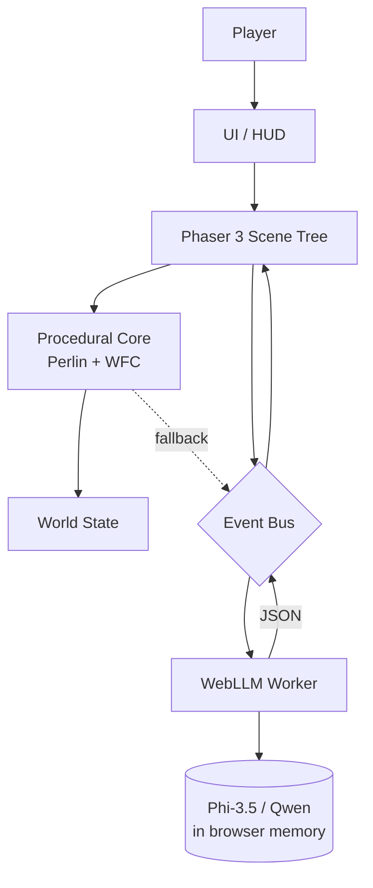

# Whimsy Shuffle 奇想洗牌世界 — Design Spec

> **Language:** This is the English source spec. For Chinese readers, see [2026-06-20-whimsy-shuffle-design.zh-CN.md](./2026-06-20-whimsy-shuffle-design.zh-CN.md).
>
> **For agentic workers:** REQUIRED SUB-SKILL: Use superpowers:subagent-driven-development (recommended) or superpowers:executing-plans to implement this plan task-by-task. Steps use checkbox (`- [ ]`) syntax for tracking.

**Goal:** Browser-based 2D sandbox casual game where each session is "shuffled" — fresh theme, fresh levels, fresh rules. Phaser 3 + WebLLM. Pure procgen works without LLM; LLM enhancement is opt-in.

**Architecture:** Two-layer. Deterministic procgen core (Perlin + WFC) builds the world. WebLLM enhancement layer (in-browser, WebGPU) adds surprise and personality. All client-side. No server. No account.

**Tech Stack:** Phaser 3 + TypeScript 5 + Vite 5 + WebLLM (browser-side LLM) + WebGPU. Default model: Phi-3.5 mini 3.8B. Optional: Qwen 2.5 7B (better Chinese).

**Branch / repo:** Keep "whimsy" name, same repo, new project path `projects/whimsy-shuffle/`.

**Purpose:** Personal learning + portfolio project. NOT a graduation project, NOT a commercial product, NOT a community-maintained project.

---

## 1. Overview

**Whimsy Shuffle** (奇想洗牌世界) is a browser-based 2D sandbox casual game where the world itself is randomly generated. Each play session is "shuffled" — a fresh theme, fresh levels, fresh rules, fresh surprises.

The game uses a **two-layer architecture**:
- A **deterministic procedural layer** (Perlin noise, Wave Function Collapse) that builds the world without any AI.
- An **AI enhancement layer** (in-browser WebLLM) that adds surprise, personality, and player-driven mutations on top.

### What it IS
- A personal portfolio + learning project demonstrating in-browser LLM integration.
- A 2D top-down Phaser 3 sandbox where each session feels novel.
- A WebGPU-accelerated, fully client-side game (no server backend).
- A demo of "AI as seasoning" — procgen is the meal, LLM is the spice.

### What it is NOT
- Not a commercial product. No monetization, no store listing, no DRM.
- Not a graduation project. No formal advisor, no thesis.
- Not an account-based game. No login, no profiles, no cloud save.
- Not a server-dependent game. Everything runs in the browser tab.
- Not a multiplayer game. Single-player only.
- Not a graphics showcase. Visual style is deliberately minimal so the procedural / AI surprises are the star.

---

## 2. Goals & Non-Goals

### Goals
- Ship a static-deployed browser game playable in a single tab on a modern desktop.
- Make the LLM **optional** — the full game loop is fun without it.
- Make the LLM **discoverable** — when it kicks in, the player notices ("oh, that was generated").
- Cover more players on average hardware (default model targets 4-6 GB VRAM).
- Make the codebase small enough to read in one sitting (a portfolio reader).
- Stay under one repo, keep the "whimsy" name, ship to itch.io + GitHub Pages.

### Non-Goals (explicit "do not do")
- Do not add accounts, authentication, or any user identity.
- Do not add a server, a database, or any persistent backend.
- Do not add multiplayer, networking, or real-time sync.
- Do not add telemetry, analytics, or third-party trackers of any kind.
- Do not add in-app purchases, ads, or any monetization.
- Do not add a mobile / touch port. Mouse + keyboard only.
- Do not depend on any external API (OpenAI, Anthropic, Replicate, etc.) at runtime.
- Do not bundle the LLM weights with the game bundle. The player's browser fetches the model from a public WebLLM-compatible cache (Hugging Face) on first run.
- Do not aim for production-grade AI safety filtering. Generated text is sandbox-scoped and player-visible only.
- Do not promise 60 FPS on integrated GPUs. Target 30-60 FPS on RTX 3060-class hardware.

---

## 3. User Experience

### 3.1 First Load (cold start)

| Step | What happens | Time budget (RTX 3060) |
|---|---|---|
| 1 | Page loads, splash screen, "Whimsy Shuffle" title + tagline | < 1s |
| 2 | Player picks mode: **Pure Procgen** / **Procgen + AI** | < 1s |
| 3 | If AI mode: WebLLM begins model download + warmup, progress bar shown | 30-90s |
| 4 | Game canvas mounts, first level procedurally generated (Perlin + WFC) | 1-3s |
| 5 | Player can start playing immediately, model load happens in background | parallel |
| 6 | Model ready, status indicator in HUD shows "AI ready" | — |

If the player closes the tab during model load, no state is lost. If they refresh, the cache is reused (subsequent loads are <5s).

### 3.2 A Typical Session (5 levels, AI mode)

| Phase | Player action | System response |
|---|---|---|
| Start | Click "New Shuffle" | LLM generates session theme (1 call, ~3-5s) |
| L1 | Walk around, discover items, talk to NPC (press `E` near them) | LLM generates a 1-2 sentence line on demand (1 call per talk, ~2-4s) |
| L1 end | Touch level exit | Advance to next level (0 LLM calls) |
| L2 | Drag a physics card onto the active level | Gravity / friction / restitution change live (0 LLM calls; card pre-baked at deck time) |
| L3 | Drag two item cards onto fusion altar | Item fusion result (1 call, ~3-5s), on opt-in |
| L4 | Free play | No LLM activity; pure exploration |
| L5 end | Touch final exit | Session summary, total LLM calls shown |

Total LLM calls: **5-10 per session** in AI mode, **0 calls** in Pure Procgen mode. **30-60s total** on RTX 3060.

### 3.3 Ongoing Play

- After one session, the player can "Reshuffle" (new session, new theme) or "Continue" (keep theme, re-roll tilemaps with a fresh WFC seed; same theme cards retained).
- Settings panel exposes: model choice, LLM on/off per mechanic, reset model cache.
- No save slots. Each session is ephemeral by design — the fun is in the shuffle.

### 3.4 Fallback UX

- If WebGPU is unavailable: show a friendly "Your browser does not support WebGPU" message and default to **Pure Procgen** mode. Game still fully playable.
- If model download fails: stay in Pure Procgen mode, show a one-line note in the HUD.
- If an LLM call times out (>15s): cancel, use procgen fallback, log nothing to the user beyond "AI skipped for speed".

---

## 4. Architecture

### 4.1 Layers

```
+--------------------------------------------------+
|  Browser Tab (static HTML / JS bundle)           |
|                                                  |
|  +-------------+    +-----------------------+    |
|  | Phaser 3    |    | WebLLM Worker         |    |
|  | Main Thread | <-> | (off-thread, WebGPU)  |    |
|  | - Scenes    |    | - Phi-3.5 / Qwen 2.5  |    |
|  | - Tilemap   |    | - prompt templates    |    |
|  | - Physics   |    | - JSON parsers        |    |
|  | - Entities  |    | - fallback handlers   |    |
|  +-------------+    +-----------------------+    |
|         ^                   ^                    |
|         |                   |                    |
|  +------|-------------------|----------------+   |
|  |      Shared Event Bus (typed pub/sub)     |   |
|  |      - Main: Phaser 3 internal bus        |   |
|  |      - Main <-> Worker: postMessage       |   |
|  |      - Worker reply: MessageChannel       |   |
|  |      - Worker-internal: own bus           |   |
|  +---------------------------------------------+  |
|         ^                                       |
|  +------|-------------------+                   |
|  | Procedural Core           |                  |
|  | - Perlin noise generator  |                  |
|  | - WFC tile sampler        |                  |
|  | - Item / NPC placement    |                  |
|  | - Physics rule registry   |                  |
|  +---------------------------+                  |
+--------------------------------------------------+
        ^
        | (CDN cache: Hugging Face web-llm)
+--------------------------------------------------+
|  Static Hosting: itch.io / GitHub Pages / nginx  |
+--------------------------------------------------+
```

### 4.2 Mermaid view



### 4.3 Threading model
- **Main thread**: Phaser render + game loop, UI, input.
- **Web Worker**: WebLLM inference (off-thread, isolates model memory and avoids frame stutter).
- **No service worker**. Cache is handled by the browser's standard HTTP cache for model files.

---

## 5. Core Mechanics

### 5.0 Card System (the "shuffle" backbone)

The whole game runs on **cards**. Every interactive element in a session — themes, physics perturbations, items, NPCs, hidden unlocks — is a card with a fixed schema. The LLM's only job is to **fill a session's deck** at start; after that, the game is fully client-driven and card effects are pre-baked.

**Why cards, not free text input:**
- **Bounded input.** No "type whatever you want" — players play cards, never generate raw text. This keeps the world controllable.
- **Bounded LLM output.** LLM fills card slots inside a strict schema, not free JSON, so output quality is higher.
- **Combinable.** Two cards fuse, an item plus a card produces a level, three cards trigger a hidden level. The card metaphor carries the whole fusion system.
- **Discoverable.** "Draw a card, play a card, fuse cards" is a familiar mechanic (Slay the Spire, Inscryption, Balatro).

**Card taxonomy** (5 types, ~34-45 cards per session):

| Type | Count / session | Source (Primary \| Procgen fallback) | Effect |
|---|---|---|---|
| Theme | 1 | LLM \| Hardcoded theme deck (Phase 1) | Locks palette, naming, quirk for the whole session |
| Physics | 8 | LLM \| Hardcoded physics table (Phase 1) | Playable; mutates active level physics (pre-baked, no LLM at play time) |
| Item | 20-30 | LLM (5) + procgen (15-25) | Pickup-able; inventory item |
| NPC | 3 | LLM \| Fixed dialogue table (Phase 1) | Defines an NPC's role + personality |
| Hidden | 2-3 | LLM \| None (hidden levels unreachable in Pure Procgen) | Specific fusion combos unlock hidden levels |

**Fusion paths** (fusion altar — all paths go through the altar; only paths 1-3 use LLM):

| # | Inputs | Output | LLM call? | Hidden level trigger |
|---|---|---|---|---|
| 1 | Item + Item | FusedItem | Yes | Never |
| 2 | Item + Physics card | FusedItem (absorbs physics effect) | Yes | Only if physics card is the matching hidden recipe (rare) |
| 3 | Item + Hidden card | HiddenLevel (or FusedItem) | Yes | **Always** (recipe match by definition) |
| 4 | Item + NPC card | FusedItem (absorbs role hint) | Yes | Only if NPC card is the matching hidden recipe (rare) |
| 5 | Card + Card | ComposedItem (no LLM) | No | Never |

Worked examples:
- Path 1: vine whip + brine comet = Brine Lash
- Path 2: Box + Moon card = Floating Box (persistent effect)
- Path 3: Box + Brine Gate card = Box World (hidden level)
- Path 5: Moon + Sea = Tide card (client-side composition)

**The shuffle metaphor is now literal**: each session = a new shuffled deck. The LLM's job shrinks to "build a coherent 30-40 card deck that fits the theme".

### 5.1 Theme & Deck Generation (always on, 1 call per session)

When a new session starts, the LLM is asked to build the entire deck in one call. This replaces the old "theme only" call.

**Example LLM output (Phi-3.5)**:
```json
{
  "themeCard": {
    "name": "Cucumber Cosmos",
    "palette": ["#a8e6cf", "#dcedc1", "#ffd3b6", "#ffaaa5", "#ff8b94"],
    "ruleQuirk": "All liquids flow upward."
  },
  "itemCards": [
    { "name": "pickled star", "spriteKey": "orb_yellow", "behavior": "glows when held" },
    { "name": "brine comet", "spriteKey": "whip_blue", "behavior": "splashes on impact" },
    { "name": "vine whip", "spriteKey": "whip_red", "behavior": "extends 3 tiles" },
    { "name": "ferment orb", "spriteKey": "orb_green", "behavior": "slows nearby liquids" },
    { "name": "dill drone", "spriteKey": "shield_gold", "behavior": "follows player for 5s" }
  ],
  "physicsCards": [
    { "name": "Moon Bounce", "gravity": 200, "restitution": 0.95, "friction": 0.1 },
    { "name": "Heavy Brine", "gravity": 1400, "restitution": 0.1, "friction": 0.8 },
    { "name": "Icy Ground", "gravity": 800, "restitution": 0.2, "friction": 0.05 },
    { "name": "Sticky Vine", "gravity": 800, "restitution": 0.0, "friction": 1.5 }
  ],
  "npcCards": [
    { "role": "cosmic pickle vendor", "personality": "rambles about brine, friendly, cryptic" },
    { "role": "wandering brine sage", "personality": "speaks in questions, philosophical" },
    { "role": "vine keeper", "personality": "terse, protective of greenery" }
  ],
  "hiddenCards": [
    { "name": "Cucumber Memory", "unlockRecipe": ["vine whip", "ferment orb"] },
    { "name": "Brine Gate", "unlockRecipe": ["brine comet", "dill drone"] }
  ]
}
```

This JSON is read by Phaser to drive visuals, populate the world, and seed NPC dialogue prompts.

### 5.2 Physics Perturbation (opt-in per level, 0 LLM calls at play time)

Player opens their hand of **physics cards** (drawn from the session deck, seeable in HUD), picks one, and drags it onto the active level. The card's effect is **pre-baked** at deck generation time — no LLM call, no text input, no ambiguity.

**Example**:
- Player hand: `[Moon Bounce, Heavy Brine, Icy Ground, Sticky Vine]`
- Player drags `Moon Bounce` onto the level.
- Phaser physics engine patches `gravity=200, restitution=0.95, friction=0.1` into the active level.
- HUD shows: "Moon Bounce active — revert at level exit"

**Opt-in & bounded**: the player picks a card, never types. Card effects came from LLM during deck generation (validated once), not free text.

### 5.3 Item Fusion (opt-in per level, 1 LLM call per fusion)

Player drags two cards onto the fusion altar. Five fusion paths (see §5.0 for the full table; the three that hit the LLM are listed here):

| Inputs | Output | LLM call? |
|---|---|---|
| Item + Item | New FusedItem | Yes (call) |
| Item + Physics card | New FusedItem (with persistent effect) | Yes (call) |
| Item + Hidden card (matching recipe) | HiddenLevel unlock | Yes (call, level-recipe branch) |
| Item + NPC card | New FusedItem (absorbs role hint) | Yes (call) |
| Card + Card | ComposedItem | No (client-side `composeCards(a, b)` from existing card stats) |

**Example: Item + Item (path 1)**:
- Input: `{ "a": "vine whip", "b": "brine comet" }`
- LLM output:
  ```json
  {
    "kind": "item",
    "name": "Brine Lash",
    "spriteKey": "whip_blue",
    "behavior": "extends and splashes on impact, freezing puddles",
    "stackable": false
  }
  ```

**Example: Item + Card = hidden level**:
- Input: `{ "item": "Box", "card": "dill drone" }`
- LLM output:
  ```json
  {
    "levelName": "Box Drone World",
    "paletteOverride": ["#c4a484", "#8b6f47", "#5e4a2f"],
    "ruleQuirk": "Boxes are alive and chatty."
  }
  ```
- The player is teleported to the unlocked level after the current one ends.

**Opt-in**: requires explicit drag onto altar. No surprise fusions.

### 5.4 NPC Dialogue (available when model loaded, N calls per session)

Each NPC draws from an **NPC card** (role + personality) generated at deck time. When the player presses `E` near an NPC, the LLM generates a 1-2 sentence in-character line, optionally hinting at a hidden card recipe or level secret. In Pure Procgen mode, a fixed dialogue table substitutes.

**Example**:
- NPC card: role = "cosmic pickle vendor", personality = "rambles about brine, friendly, cryptic"
- Player presses `E`.
- LLM output (streamed if WebLLM supports it, else batched): `"Ah, traveler! The brine runs thin near the eastern gate. I left a ferment orb there in '98. Or was it '99? Time pickles everything."`

**Trigger**: press `E` within 1.5 tiles of an NPC. **No surprise** — no auto-popup, no scheduled dialogue. The trigger is always a player action.

**Available (when model is loaded)**: every talk press generates a fresh line. No per-call opt-in toggle.

### 5.5 Hidden Levels (unlocked by hidden card recipes, 1 call per unlock)

The 2-3 **hidden cards** in the deck each carry a `unlockRecipe` — a specific pair of in-world items. When the player fuses that exact pair, a hidden level is unlocked.

**Example**:
- Hidden card "Cucumber Memory": recipe = `[vine whip, ferment orb]`
- Player drags `vine whip` + `ferment orb` onto altar.
- LLM is called to generate the hidden level's name, palette, and rule quirk.
- The level is added to the session and becomes reachable via the level select.

**Why this is better than the old "find a tile, read text" eggs:**
- It's a discovery *plus* an action (fuse) — the player has agency.
- The reward is a level, not a sentence — replayable, not one-shot.
- The hidden cards' recipes are deliberately *almost* matching common fusions, so players discover them by experimenting.

### 5.6 Pure Procgen Mode (default opt-out)

All five LLM-driven mechanics above are **disabled**. World, items, NPCs, rules, and cards are all generated by deterministic Perlin + WFC + a hardcoded deck of 16 themes (each theme is a hand-authored card bundle). Dialogue becomes fixed template strings. Hidden levels become unreachable.

---

## 6. Data Model

### 6.1 Card (the universal atomic unit)

All interactive content in a session is a card. The `type` discriminator decides which fields are populated.

```ts
type CardType = "theme" | "physics" | "item" | "npc" | "hidden";

interface Card {
  id: string;                  // uuid
  type: CardType;
  name: string;                // 1-3 words
  // Type-specific payloads (only one is populated based on `type`):
  themePayload?: ThemePayload;
  physicsPayload?: PhysicsPayload;
  itemPayload?: ItemPayload;
  npcPayload?: NpcPayload;
  hiddenPayload?: HiddenPayload;
  generatedBy: "llm" | "fallback";
  generatedAt: number;         // epoch ms
}

interface ThemePayload {
  palette: string[];           // 5 hex colors
  ruleQuirk: string;           // 1 sentence
}

interface PhysicsPayload {
  gravity: number;             // 100-2000, default 800
  restitution: number;         // 0-1, default 0.3
  friction: number;            // 0-1.5, default 0.5
  note: string;                // HUD tooltip
}

interface ItemPayload {
  spriteKey: string;           // snake_case, from sprite palette
  behavior: string;            // 1 sentence, for fusion prompts
  stackable: boolean;
  // World placement (assigned at deck activation, not generation):
  spawnPool?: "common" | "rare";
}

interface NpcPayload {
  role: string;                // 2-4 words
  personality: string;         // 1 sentence prompt seed
}

interface HiddenPayload {
  unlockRecipe: [string, string]; // pair of item names that, when fused, unlock a level
}
```

### 6.2 Deck (per session)

```ts
interface Deck {
  id: string;                  // uuid, same as session id
  themeCard: Card;             // 1
  physicsCards: Card[];        // 8
  itemCards: Card[];           // 20-30
  npcCards: Card[];            // 3
  hiddenCards: Card[];         // 2-3
  generatedBy: "llm" | "fallback";
  generatedAt: number;
}
```

### 6.3 Level
```ts
type Tile = 0 | 1 | 2 | 3 | 4;  // 0=floor, 1=wall, 2=water, 3=grass, 4=flower
type CardId = string;

interface Level {
  index: number;               // 0..4 (+ unlocked hidden levels)
  deck: Deck;                  // reference to session deck
  tilemap: number[];           // WFC tile indices, length = widthTiles * heightTiles
  widthTiles: number;          // default 64
  heightTiles: number;         // default 48
  spawnedItems: PlacedItem[];  // itemCards placed in this level
  npcs: PlacedNpc[];           // npcCards placed in this level
  activePhysicsCardId: string | null; // ref to deck.physicsCards[i]; set by player
  exitTile: { x: number; y: number };
  unlockedByHiddenCardId?: string;    // ref to deck.hiddenCards[i]; only set if this is a hidden level
}

interface PlacedItem {
  cardId: string;              // ref to Card in deck.itemCards
  pos: { x: number; y: number };
}

interface PlacedNpc {
  cardId: string;              // ref to Card in deck.npcCards
  pos: { x: number; y: number };
  dialogueHistory: string[];   // last 3 lines
}
```

### 6.4 FusedItem and ComposedItem (fusion products)

**FusedItem** — produced by the LLM fusion prompt (paths 1-4 in §5.0). The LLM writes the name, sprite, and behavior.

```ts
interface FusedItem {
  id: string;
  name: string;
  spriteKey: string;
  behavior: string;
  stackable: boolean;
  fusedAt: number;             // epoch ms
  fusedFrom: {
    type: "item+item" | "item+card";
    inputs: [CardId, CardId];  // refs to source cards
  };
}
```

**ComposedItem** — produced by the client-side `composeCards(a, b)` function (path 5 in §5.0). Deterministic; no LLM call; output is looked up in `src/core/cardComposition.ts`. Card+Card never produces a FusedItem.

```ts
interface ComposedItem {
  id: string;
  name: string;
  spriteKey: string;
  composedFrom: [CardId, CardId]; // refs to source cards
  composedAt: number;              // epoch ms
}
```

**Inventory storage** — both FusedItem and ComposedItem live in `WorldState.inventory` alongside raw `Card` items (see §6.6).

### 6.5 HiddenLevel (unlocked by hidden card recipe)

```ts
interface HiddenLevel {
  id: string;
  name: string;
  paletteOverride: string[];   // 3-5 hex colors
  ruleQuirk: string;
  unlockRecipeCardId: string;  // ref to Card in deck.hiddenCards
}
```

### 6.6 WorldState (in-memory only)
```ts
interface WorldState {
  deck: Deck | null;
  levels: Level[];             // base 5 + any unlocked hidden levels
  currentLevelIndex: number;
  activePhysicsCardId: string | null;  // ref to deck.physicsCards[i]; persists across level transitions
  inventory: (Card | FusedItem | ComposedItem)[]; // Card entries must have type === 'item'
  hand: Card[];                // physics cards currently in player's hand (subset of deck.physicsCards)
  unlockedHiddenLevelIds: string[]; // refs to levels[] that were unlocked mid-session
  llmStats: {
    callsThisSession: number;
    totalLatencyMs: number;
    timeoutsThisSession: number;
  };
  mode: "procgen" | "ai";
  modelStatus: "unloaded" | "loading" | "ready" | "unavailable";
}
```

**Why cards are first-class:**
- All schemas reference `Card` (or a card id) — no parallel "Theme" or "PhysicsPatch" type.
- `Deck` replaces the old `SessionTheme`.
- The fusion altar reads inputs as `(Card | FusedItem, Card | FusedItem)` — types are uniform.
- The procgen fallback can produce a fully-functional deck of hardcoded cards without ever touching the LLM.

---

## 7. LLM Prompt Design

All prompts fit in a 1024-token context and produce a single JSON object (or single string for hidden egg). A shared `safeParseLLMJson(raw)` wrapper: trim, strip code fences, attempt `JSON.parse`, on failure strip trailing commas, retry once with a "fix this JSON" continuation prompt, on second failure call the procgen fallback for that mechanic.

### 7.1 Deck generation (replaces old theme generation)

This is the single biggest LLM call. It produces the entire session's deck in one shot.

```
SYSTEM: You build a coherent deck of cards for a whimsical 2D game world. Always respond with one JSON object. No prose, no markdown, no preamble.

USER: Build a complete session deck. Constraints:
- 1 theme card: name (2-3 words), palette (exactly 5 hex colors, no dupes), ruleQuirk (1 sentence, max 12 words)
- exactly 8 physics cards: name (1-3 words), gravity (int 100-2000), restitution (float 0-1), friction (float 0-1.5), note (max 8 words)
- exactly 5 item cards (the rest are auto-filled from the procgen pool): name (1-3 words), spriteKey from this set [whip_red, whip_blue, orb_green, orb_yellow, sword_cyan, sword_violet, shield_gold, potion_pink], behavior (1 sentence, max 12 words), stackable (false)
- exactly 3 NPC cards: role (2-4 words), personality (1 sentence, max 15 words)
- exactly 2 hidden cards: name (2-3 words), unlockRecipe (a pair of item names from itemCards)

All cards must feel like they belong to the same world.

JSON shape:
{
  "themeCard": { "name": "...", "palette": ["#...", ...], "ruleQuirk": "..." },
  "physicsCards": [{ "name": "...", "gravity": <int>, "restitution": <float>, "friction": <float>, "note": "..." }, ...],
  "itemCards": [{ "name": "...", "spriteKey": "snake_case", "behavior": "...", "stackable": false }, ...],
  "npcCards": [{ "role": "...", "personality": "..." }, ...],
  "hiddenCards": [{ "name": "...", "unlockRecipe": ["item name A", "item name B"] }, ...]
}
```

### 7.2 Physics perturbation — REMOVED

The old "player types a phrase" mechanic is gone. The LLM has already produced the 8 physics cards during deck generation; the player just plays one. No LLM call at perturbation time.

### 7.3 Item fusion (handles 3 paths)

```
SYSTEM: You fuse two items (or one item + one card) into a new game item, or unlock a hidden level. Respond with one JSON object only. No prose, no markdown, no preamble.

USER: Fusion input:
- A: {{INPUT_A_NAME}} — type: {{INPUT_A_TYPE}} — behavior: {{INPUT_A_BEHAVIOR}}
- B: {{INPUT_B_NAME}} — type: {{INPUT_B_TYPE}} — behavior: {{INPUT_B_BEHAVIOR}}

Pick the right fusion path:
- If both A and B are items: produce a new FusedItem.
- If one is an item and the other is a card (physics/npc/hidden/theme): produce a new FusedItem that absorbs the card's effect, OR a HiddenLevel if the card is a hidden card matching the recipe.
- If a hiddenCard with matching unlockRecipe is in play: produce a HiddenLevel.

JSON shape (FusedItem):
{"kind": "item", "name": "...", "spriteKey": "snake_case from sprite palette", "behavior": "...", "stackable": false}

JSON shape (HiddenLevel):
{"kind": "level", "levelName": "...", "paletteOverride": ["#...", ...], "ruleQuirk": "..."}

Constraints:
- FusedItem name: 1-3 words
- FusedItem behavior: 1 sentence, max 15 words
- HiddenLevel ruleQuirk: 1 sentence, max 12 words
```

### 7.4 NPC dialogue
```
SYSTEM: You roleplay a game NPC. Stay in character, keep it 1-2 sentences, no preamble.

USER:
NPC card: {{NPC_CARD_JSON}}
  - role: {{NPC_ROLE}}
  - personality: {{NPC_PERSONALITY}}
World theme: {{THEME_NAME}} — {{THEME_QUIRK}}
Hidden card hints in this world: {{HIDDEN_CARD_RECIPES_JSON}}   // may hint at recipes in dialogue
Player just: {{PLAYER_ACTION}} ("talked to me")
Last 3 things you said: {{DIALOGUE_HISTORY_JSON}}

Speak now. Avoid repeating the same opener as your history. You may hint at a hidden card recipe, but never name both items directly.
```

### 7.5 Hidden level generation

Triggered by a hiddenCard recipe match. Same call as fusion path 3 (item + hidden card, handled inside the fusion prompt above, when `kind: "level"` is produced). No separate prompt.

### 7.6 Card + Card composition — handled on client (no LLM)

Card + Card composition is deterministic and handled in `cardSystem.composeCards(a, b)` on the client. No LLM call. Example: `Moon + Sea` always produces `Tide` (a card with both effects combined). The composition table is in `src/core/cardComposition.ts` and is hand-authored. The result is a `ComposedItem` (not a `FusedItem` — see §6.4).

### 7.7 Output parsing
- A single shared `safeParseLLMJson(raw)` helper handles all 3 JSON-shaped calls (deck gen, item fusion, NPC dialogue).
- NPC dialogue returns a string (not JSON) — uses a simpler `trim + take first non-empty line` parser.
- On any 2nd-failure, the per-mechanic procgen fallback runs (see §5.6 and §8.2).

---

## 8. Performance Budget

### 8.1 Hard targets (RTX 3060, 12GB VRAM, Chrome stable)

| Phase | Target | Hard ceiling |
|---|---|---|
| Cold page load to first frame | < 2s | 5s |
| First level procedurally generated | < 3s | 6s |
| Model download (Phi-3.5, ~2.3GB) | 60s | 120s |
| Model warmup (compile + first token) | 5s | 15s |
| Subsequent model loads (cached) | < 3s | 8s |
| Theme / deck generation LLM call | 5-8s | 15s timeout |
| Item fusion LLM call | 3-5s | 12s timeout |
| NPC dialogue LLM call | 2-4s | 10s timeout |
| Hidden level unlock (per fusion hit) | 3-5s | 12s timeout |
| Physics perturbation (client-side, no LLM) | < 16ms | 1 frame |
| Total LLM time per 5-level session | 30-60s | 90s |
| Frame rate during LLM inference | 30-60 FPS | 20 FPS minimum |
| Memory footprint (JS heap + model) | < 6GB | 8GB |

### 8.2 Fallback chain
1. WebGPU unavailable -> Pure Procgen mode, hide AI option in UI.
2. Model download fails -> Pure Procgen mode, show one-time HUD note.
3. LLM call times out -> cancel, use procgen fallback for that mechanic, increment `timeoutsThisSession` stat.
4. LLM call returns malformed JSON after 1 retry -> use procgen fallback, log to console only.
5. Browser tab backgrounded during session -> pause model, resume on focus.

### 8.3 What we do NOT optimize
- We do not aim for sub-2s per call. Phi-3.5 mini on RTX 3060 produces ~30-40 tok/s; 200-token responses naturally take 5-7s. Trying to compress prompts below ~150 tokens breaks output quality.
- We do not pre-bundle the model. The first-time download is the cost of in-browser AI; subsequent loads use the browser HTTP cache.

---

## 9. Project Structure

```
whimsy/
  docs/
    superpowers/
      specs/
        2026-06-20-whimsy-shuffle-design.md   <- this spec
      plans/
        ...                                    <- per-phase plans
  projects/
    whimsy-shuffle/
      README.md
      package.json
      tsconfig.json
      vite.config.ts                          <- build tool
      index.html
      public/
        sprites/                              <- all PNG/sprite assets
          atlas/                              <- Phaser single-shot preload (atlas + json)
            cards.png + cards.json
            items.png + items.json
            npcs.png + npcs.json
            tiles.png + tiles.json
          raw/                                <- un-paked source images (dev only)
            tiles/
            items/
            npcs/
            ui/
            vfx/
        sfx/                                 <- short SFX (preload, <500KB total)
          draw.wav
          place.wav
          fuse.wav
          reveal.wav
          hint.wav
          error.wav
        bgm/                                 <- themed BGM (lazy load, 1 per theme)
          forest.ogg
          ocean.ogg
          dungeon.ogg
          scifi.ogg
          default.ogg
        favicon.ico
      src/
        main.ts                               <- entry point
        config/
          model.ts                            <- model registry
          prompts.ts                          <- prompt templates
          constants.ts
          assets.ts                           <- asset manifest (URL + license + sha256)
        core/
          eventBus.ts                         <- typed pub/sub
          worldState.ts                       <- WorldState container
          save.ts                             <- in-memory only
          cardSystem.ts                       <- Card / Deck / Fusion core (LLM-independent)
          cardComposition.ts                  <- card+card deterministic composition table
        procgen/
          perlin.ts
          wfc.ts                              <- Wave Function Collapse
          itemTable.ts                        <- hardcoded item pool
          deckFallback.ts                     <- 16 hardcoded decks (one per theme)
        phaser/
          scenes/
            BootScene.ts
            MenuScene.ts
            GameScene.ts
            HudScene.ts
            HandScene.ts                      <- physics card hand view
          entities/
            Player.ts
            Npc.ts
            ItemEntity.ts
            CardEntity.ts                     <- card-on-ground pickup
            FusionAltar.ts
          tilemap/
            levelLoader.ts
        llm/
          worker.ts                           <- WebLLM Web Worker entry
          modelLoader.ts                      <- main-thread proxy
          prompts.ts                          <- imports from config
          parsers.ts                          <- safeParseLLMJson
          callQueue.ts                        <- serializes + timeouts
          fallback.ts                         <- per-mechanic procgen fallback
        ui/
          Hud.ts
          SettingsPanel.ts
          CardHandView.ts                     <- player's physics card hand
          FusionAltarUI.ts                    <- drag two cards to fuse
          Attribution.ts                      <- About "Credits" tab (TS, not TSX)
        utils/
          uuid.ts
          color.ts
          assetLoader.ts                     <- Phaser loader wrapper (atlas/image/sfx/bgm)
      tests/
        procgen/
        llm/
        cardSystem/                           <- card composition, fusion, hidden level
        e2e/                                  <- Playwright
      benchmark/                              <- perf scripts
        measureLoad.ts
        measureInference.ts
```

---

## 10. Assets & Resource Libraries

### 10.1 Selection principles

Whimsy Shuffle is an "AI-randomly-generated sandbox" — every run has a different theme, tile set, and visual style. **Visual consistency doesn't matter**; what matters is **safe licensing + stable sources + sufficient volume**.

| Principle | Why |
|---|---|
| **CC0 first** | Public domain, no attribution, no commercial-use review |
| **Royalty-Free fallback** | Name-your-price but commercial-OK — only for card-specialized needs |
| **Avoid GPL family** | Copyleft is incompatible with permissive distribution |
| **Avoid AI-generated images** | Training-data provenance is unclear, copyright unclear |
| **Inconsistent style = advantage** | Each run draws tiles / BGM from different sources; player never notices "all Kenney" |

### 10.2 Optimal asset sources (category mapping)

| Asset category | Recommended source | License | Fallback |
|---|---|---|---|
| **Card frame / back** | [cafeDraw Fantasy Card Assets](https://cafedraw.itch.io/fantasy-card-assets) | Royalty-Free | — |
| **Card UI / table / animations** | [Praan Card Game 2D UI](https://praan.itch.io/cardgame2d) | Royalty-Free | — |
| **Item sprites** | [Kenney](https://kenney.nl/assets) | CC0 | freegamesprites.com (CC0) |
| **NPC characters** | Kenney character packs | CC0 | freegamesprites.com (CC0) |
| **Themed tile sets** | OpenGameArt themed packs (per-pack license audit) | CC0 / CC-BY | Kenney Platformer (CC0) |
| **Particles / VFX** | Kenney Light Masks | CC0 | OpenGameArt particles (mixed) |
| **UI buttons / panels** | Kenney UI Pack + UI Expansion | CC0 | — |
| **SFX** (6 core) | [Mixkit Game SFX](https://mixkit.co/free-sound-effects/game/) | Mixkit License | Kenney Audio (CC0) / Pixabay (no attribution) |
| **BGM** (themed loops) | [Pixabay Music](https://pixabay.com/music/) | Pixabay License (no attribution) | — |
| **English font** | [Inter](https://rsms.me/inter/) via Google Fonts | OFL 1.1 | — |
| **Chinese font** | System fallback (PingFang SC / Microsoft YaHei) | system | — |
| **Phase 1 placeholders** | [phaserjs/examples](https://github.com/phaserjs/examples) `public/assets/` | MIT | — |

**Relation to §4 architecture**: itch.io is both a deployment target and an asset source (cafeDraw / Praan / KayKit all live on itch.io). GitHub Pages and nginx only host; they do not provide assets.

### 10.3 Resource directory layout (§9 supplement)

```
public/
  sprites/
    atlas/                                 <- Phaser single-shot preload
      cards.json + cards.png               <- 64×96 frame, 16 cols
      items.json + items.png               <- 32×32 frame, 32 cols
      npcs.json + npcs.png                 <- 64×64 frame, 16 cols
      tiles.json + tiles.png               <- 16×16 frame, 32 cols
    raw/                                   <- un-paked source images (dev only)
      tiles/
      items/
      npcs/
      ui/
      vfx/
  sfx/                                     <- short SFX (preload)
    draw.wav
    place.wav
    fuse.wav
    reveal.wav
    hint.wav
    error.wav
  bgm/                                     <- themed BGM (lazy load)
    forest.ogg
    ocean.ogg
    dungeon.ogg
    scifi.ogg
    default.ogg
  favicon.ico
src/
  config/
    assets.ts                              <- asset manifest (URL + license + sha256)
  core/
    assetLoader.ts                         <- Phaser loader wrapper
  ui/
    Attribution.tsx                        <- About "credits" tab
```

### 10.4 Loading strategy

| Strategy | Rule |
|---|---|
| **atlas single-shot preload** | BootScene uses `this.load.atlas('cards', 'atlas/cards.png', 'atlas/cards.json')` — one atlas load, not 100 single-image requests |
| **Per-theme lazy load** | GameScene.start loads only the selected theme's tile + BGM |
| **BGM on demand** | First entry to a themed level fetches `bgm/{theme}.ogg`; avoid 16 themes × 3MB blocking first paint |
| **SFX full preload** | 6 SFX total <500KB, preload in BootScene |
| **Non-blocking font** | `<link rel="preload" as="style" href="Inter">` + `font-display: swap`; first paint uses fallback |
| **HTTP cache** | Vite emits `[hash].[ext]`; `Cache-Control: public, max-age=31536000, immutable` |

### 10.5 License credits (About page required)

The About modal's "Credits" tab must list every source.

| Source | License | Attribution required |
|---|---|---|
| Kenney | CC0 | No |
| freegamesprites.com | CC0 | No |
| cafeDraw Fantasy Card | Royalty-Free | Yes (optional) |
| Praan Card Game 2D UI | Royalty-Free | Yes (optional) |
| Mixkit SFX | Mixkit License | Yes (About link) |
| Pixabay Music/SFX | Pixabay License | No (recommended) |
| OpenGameArt themed tiles | CC0 / CC-BY | Depends on pack |
| Phaser examples | MIT | No |
| Inter font | OFL 1.1 | No |

**Implementation location**: `src/ui/Attribution.ts` (TS, not TSX — this project does not use React). Rendered by the in-game About modal "Credits" tab.

### 10.6 Card visuals vs asset mapping

| Card type | Visual composition |
|---|---|
| `themeCard` | frame sliced from atlas/cards.png + Phaser tint (theme color index 0-4) |
| `physicsCard` | generic card back + icon from atlas/items.png |
| `itemCard` | matching sprite from atlas/items.png + card frame |
| `npcCard` | matching sprite from atlas/npcs.png + card frame |
| `hiddenCard` | golden particle effect on card back + hidden icon |

**Key design**: LLM-generated "card name / description" only renders in the text area on the card front; **it does NOT map to a sprite**. Sprites are a pre-baked finite pool; LLM can only pick from existing sprites. This avoids the awkward "LLM outputs a dragon card but we have no dragon sprite" case.

### 10.7 Explicitly not doing

- **No** AI-generated images (SD / DALL-E / Midjourney) — training-data provenance unclear
- **No** hand-drawing pixel art — not a core value, too time-consuming
- **No** buying commercial sprite packs — budget is 0
- **No** sprite recolor variants — use Phaser tint at runtime, zero asset cost
- **No** 3D models — 2D sandbox positioning
- **No** GPL-licensed assets — copyleft conflicts with permissive distribution

### 10.8 Asset pipeline tasks (cross-phase)

| Task | Phase | Description | Asset size |
|---|---|---|---|
| Asset manifest | 1 | `src/config/assets.ts` lists every URL + license + sha256 | — |
| Download core packs | 1 | Kenney UI Pack + cafeDraw cards + Mixkit 6 SFX + Phaser examples placeholders | ~3MB |
| Sprite atlas build | 1 | `free-tex-packer` produces atlas + JSON | ~6MB |
| assetLoader.ts | 1 | Phaser loader wrapper, supports atlas / single-image / SFX / BGM | — |
| Placeholder swap | 1 | Replace Phaser examples `dude/star/bomb` with Kenney character + item | — |
| Attribution page | 1 | Add "Credits" tab to About modal, render §10.5 table | — |
| SFX integration | 2 | Wire 6 SFX into eventBus, triggered by play | — |
| Themed tile + BGM | 2 | Pick 4-6 themed packs from OpenGameArt + match BGM from Pixabay, lazy load | ~10MB |
| Lazy BGM loader | 2 | `bgm/{theme}.ogg` on-demand fetch + loading state | — |
| Theme expansion | 3 | Map all 16 themes to tile + BGM | ~20MB |

---

## 11. Implementation Phases

### Phase 1 — Pure Procgen (no LLM, no WebGPU required)
**Goal**: A fully playable, fun sandbox with zero AI dependency. The deck is built from 16 hardcoded theme bundles. All card mechanics work without LLM.

| Task | Description | Done when |
|---|---|---|
| 1.1 | Vite + Phaser 3 + TypeScript scaffold boots in browser | `npm run dev` shows black canvas |
| 1.2 | Perlin noise terrain generator + tile renderer | Walkable, visible terrain |
| 1.3 | Player controller (top-down, WASD + mouse aim) | Player can move, collide with walls |
| 1.4 | WFC tile sampler for biome + decoration | 5 distinct biome variants |
| 1.5 | Card data model + Deck container + 5 hardcoded decks (one per biome; 16 total reached in Phase 3) | All card types round-trip through `Card` interface |
| 1.6 | CardEntity (card-on-ground) + pickup + inventory (max 6 slots) | Pick up a card, see in HUD |
| 1.7 | NPC entity + proximity prompt + fixed dialogue table | Talk to NPC, see templated line |
| 1.8 | Level exit trigger + 5-level session loop | Play through 5 levels end-to-end |
| 1.9 | CardHandView: physics cards visible in HUD, drag-onto-level to apply | Drag Moon Bounce card onto level, physics change |
| 1.10 | FusionAltarUI: drag two item cards, get hand-authored fused item | Drag vine whip + brine comet -> Brine Lash |
| 1.11 | Hidden card recipe check: matching pair unlocks a hardcoded hidden level | Fuse matching pair, new level appears in level select |
| 1.12 | Settings panel: mode toggle (locks to "procgen" in this phase) | UI works |
| 1.13 | Static deploy to GitHub Pages | Game loads from `https://...github.io/...` |

**LLM calls in Phase 1: 0.** Game is complete and shippable at end of Phase 1.

### Phase 2 — LLM Deck Generation (AI opt-in, 1 mechanic)
**Goal**: Prove the WebLLM integration works end-to-end by generating the deck in one call. Replaces the 16 hardcoded decks with LLM-authored ones.

| Task | Description | Done when |
|---|---|---|
| 2.1 | WebLLM dependency added, Web Worker scaffold created | Worker boots, model URL configured |
| 2.2 | Model loader: download + warmup + progress events in HUD | Progress bar shows during download |
| 2.3 | Deck-generation prompt template + JSON parser + deck fallback | First successful deck parsed; fallback path tested |
| 2.4 | Deck data flows into Phaser: theme palette recolor, card names, NPC roles | World visibly changes per session |
| 2.5 | Settings panel: model picker (Phi-3.5 default, Qwen 2.5 optional) | Player can switch models |
| 2.6 | Graceful degradation: WebGPU missing -> hide AI option, stay procgen | Tested in non-WebGPU browser |
| 2.7 | Model cache reuse: second load <5s | Tested with refresh |

**LLM calls per session in Phase 2: 1** (deck generation). Total: 5-8s on RTX 3060 (larger output than old theme-only call).

### Phase 3 — Full AI Enhancement (fusion + dialogue + hidden)
**Goal**: Remaining LLM-driven mechanics wired. Card hand and physics perturbation are already client-side; the only LLM work left is item fusion, NPC dialogue, and hidden level generation.

| Task | Description | Done when |
|---|---|---|
| 3.1 | Item fusion: extend fusion altar to call LLM, parse FusedItem or HiddenLevel | Fuse vine whip + brine comet -> LLM-generated Brine Lash |
| 3.2 | Hidden level unlock: LLM generates palette + quirk for unlocked level | Unlock Box World, level loaded with new visual style |
| 3.3 | NPC dialogue: replace fixed table with LLM-generated lines, history context | Talk to NPC, get unique 1-2 sentence line |
| 3.4 | Hidden recipe hints in NPC dialogue: NPC may hint at recipe items | Talk to right NPC, get a clue about the hidden pair |
| 3.5 | Call queue: serialize LLM calls, enforce timeouts, increment stats | No two calls overlap, all respect budget |
| 3.6 | Per-mechanic fallback: each mechanic has a procgen fallback path | Disable model mid-game, game still works |
| 3.7 | End-to-end perf test: 5-level session, LLM on, measure total time | < 90s on RTX 3060 |
| 3.8 | Cross-browser smoke: Chrome stable, Edge stable | Both load and play |
| 3.9 | Deploy to itch.io | Public page live |

**LLM calls per session in Phase 3: 5-10.** Total: 30-60s on RTX 3060.

---

## 12. Success Criteria

### Phase 1 done means
- A new player can load the page and play a 5-level session in under 5 minutes.
- Each new "Reshuffle" produces a visibly different deck (theme palette, card names, NPC roles, physics effects).
- The player can drag a physics card onto a level and see physics change live, with no LLM call.
- The player can fuse two item cards on the fusion altar and see a new item appear.
- The player can fuse a hidden-card recipe pair and unlock a hidden level.
- The game runs at 30+ FPS on an RTX 3060 with no model loaded.
- The codebase fits in one developer's head (~2500 lines of game code, including card system).
- Static deploy works: open URL, play immediately, no console errors.
- A portfolio reader can clone, `npm install`, `npm run dev`, and play in under 2 minutes.

### Phase 2 done means
- A player who picks "Procgen + AI" sees a model download progress bar on first run.
- After the model is ready, a new session produces a deck whose theme palette is reflected in the in-game tiles, items, and NPCs.
- The deck is a coherent theme card + 8 physics cards + 5 LLM-authored item cards + 3 NPC cards + 2 hidden cards, all validated against schema, none garbage.
- If the player closes the tab during model load and returns, the model is cached and load is < 5s.
- The mode toggle in settings still works and "Pure Procgen" never touches the model code path.
- End-to-end smoke test: in AI mode, every new session has a non-empty, valid `Deck` JSON.

### Phase 3 done means
- All LLM-driven mechanics (item fusion LLM call, NPC dialogue, hidden level generation) are reachable via documented player actions.
- A 5-level session with AI mode on makes 5-10 LLM calls totaling 30-60s on RTX 3060.
- Disabling the model mid-game does not crash; the game continues with procgen fallbacks for fusion dialogue and hidden level.
- No LLM call exceeds its 15s timeout. Timeouts trigger fallback within 1 frame.
- The LLM worker does not block the main thread; frame rate stays at 30+ FPS during inference.
- A second play session after a refresh loads in < 5s and reaches the first level in < 3s.
- An itchio page is live and the build is reproducible from `npm run build`.

---

## 13. Explicitly Out of Scope

This is a local standalone game. The following are off-limits because they would contradict that core shape:

| Concern | Why out | What we do instead |
|---|---|---|
| User accounts | No identity needed for a local game | No accounts at all |
| Cloud save | No backend by design | Sessions are ephemeral |
| Multiplayer | Single-player sandbox | Not planned |
| Commercial monetization | Not a product | Free, no payments |
| Production safety filtering | Player-visible, sandbox-scoped text | Best-effort prompt constraints |
