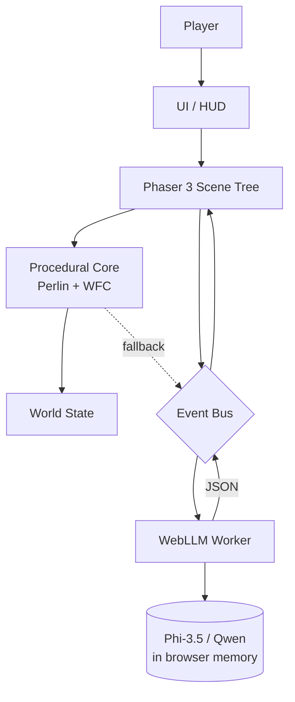

# Whimsy Shuffle 奇想洗牌世界 — Design Spec

> **For agentic workers:** REQUIRED SUB-SKILL: Use superpowers:subagent-driven-development (recommended) or superpowers:executing-plans to implement this plan task-by-task. Steps use checkbox (`- [ ]`) syntax for tracking.

**Goal:** Browser-based 2D sandbox casual game where each session is "shuffled" — fresh theme, fresh levels, fresh rules. Phaser 3 + WebLLM. Pure procgen works without LLM; LLM enhancement is opt-in.

**Architecture:** Two-layer. Deterministic procgen core (Perlin + WFC) builds the world. WebLLM enhancement layer (in-browser, WebGPU) adds surprise and personality. All client-side. No server. No account.

**Tech Stack:** Phaser 3 + TypeScript 5 + Vite 5 + WebLLM (browser-side LLM) + WebGPU. Default model: Phi-3.5 mini 3.8B. Optional: Qwen 2.5 7B (better Chinese).

**Branch / repo:** Keep "whimsy" name, same repo, new project path `projects/whimsy-shuffle/`.

**Purpose:** Personal learning + portfolio project. NOT a graduation project, NOT a commercial product, NOT a community-maintained project.

---

## 1. Overview

**Whimsy Shuffle** (奇想洗牌世界) is a browser-based 2D sandbox casual game where the world itself is randomly generated. Each play session is "shuffled" — a fresh theme, fresh levels, fresh rules, fresh surprises.

The game uses a **two-layer architecture**:
- A **deterministic procedural layer** (Perlin noise, Wave Function Collapse) that builds the world without any AI.
- An **AI enhancement layer** (in-browser WebLLM) that adds surprise, personality, and player-driven mutations on top.

### What it IS
- A personal portfolio + learning project demonstrating in-browser LLM integration.
- A 2D top-down Phaser 3 sandbox where each session feels novel.
- A WebGPU-accelerated, fully client-side game (no server backend).
- A demo of "AI as seasoning" — procgen is the meal, LLM is the spice.

### What it is NOT
- Not a commercial product. No monetization, no store listing, no DRM.
- Not a graduation project. No formal advisor, no thesis.
- Not an account-based game. No login, no profiles, no cloud save.
- Not a server-dependent game. Everything runs in the browser tab.
- Not a multiplayer game. Single-player only.
- Not a graphics showcase. Visual style is deliberately minimal so the procedural / AI surprises are the star.

---

## 2. Goals & Non-Goals

### Goals
- Ship a static-deployed browser game playable in a single tab on a modern desktop.
- Make the LLM **optional** — the full game loop is fun without it.
- Make the LLM **discoverable** — when it kicks in, the player notices ("oh, that was generated").
- Cover more players on average hardware (default model targets 4-6 GB VRAM).
- Make the codebase small enough to read in one sitting (a portfolio reader).
- Stay under one repo, keep the "whimsy" name, ship to itch.io + GitHub Pages.

### Non-Goals (explicit "do not do")
- Do not add accounts, authentication, or any user identity.
- Do not add a server, a database, or any persistent backend.
- Do not add multiplayer, networking, or real-time sync.
- Do not add telemetry, analytics, or third-party trackers of any kind.
- Do not add in-app purchases, ads, or any monetization.
- Do not add a mobile / touch port. Mouse + keyboard only.
- Do not depend on any external API (OpenAI, Anthropic, Replicate, etc.) at runtime.
- Do not bundle the LLM weights with the game bundle. The player's browser fetches the model from a public WebLLM-compatible cache (Hugging Face) on first run.
- Do not aim for production-grade AI safety filtering. Generated text is sandbox-scoped and player-visible only.
- Do not promise 60 FPS on integrated GPUs. Target 30-60 FPS on RTX 3060-class hardware.

---

## 3. User Experience

### 3.1 First Load (cold start)

| Step | What happens | Time budget (RTX 3060) |
|---|---|---|
| 1 | Page loads, splash screen, "Whimsy Shuffle" title + tagline | < 1s |
| 2 | Player picks mode: **Pure Procgen** / **Procgen + AI** | < 1s |
| 3 | If AI mode: WebLLM begins model download + warmup, progress bar shown | 30-90s |
| 4 | Game canvas mounts, first level procedurally generated (Perlin + WFC) | 1-3s |
| 5 | Player can start playing immediately, model load happens in background | parallel |
| 6 | Model ready, status indicator in HUD shows "AI ready" | — |

If the player closes the tab during model load, no state is lost. If they refresh, the cache is reused (subsequent loads are <5s).

### 3.2 A Typical Session (5 levels, AI mode)

| Phase | Player action | System response |
|---|---|---|
| Start | Click "New Shuffle" | LLM generates session theme (1 call, ~3-5s) |
| L1 | Walk around, discover items, talk to NPC | LLM-generated NPC dialogue streams in |
| L1 end | Touch level exit | Per-level hidden easter egg generated (1 call, ~2-3s) |
| L2 | Open perturbation panel, type "spicy" | Physics rules mutated for this level (1 call, ~3-5s) |
| L3 | Drag two items onto fusion altar | Item fusion result (1 call, ~3-5s), on opt-in |
| L4 | Free play | Optional surprise LLM moment |
| L5 end | Touch final exit | Session summary, total LLM calls shown |

Total LLM calls: **5-10 per session**, **30-60s total** on RTX 3060.

### 3.3 Ongoing Play

- After one session, the player can "Reshuffle" (new session, new theme) or "Continue" (keep theme, new levels).
- Settings panel exposes: model choice, LLM on/off per mechanic, reset model cache.
- No save slots. Each session is ephemeral by design — the fun is in the shuffle.

### 3.4 Fallback UX

- If WebGPU is unavailable: show a friendly "Your browser does not support WebGPU" message and default to **Pure Procgen** mode. Game still fully playable.
- If model download fails: stay in Pure Procgen mode, show a one-line note in the HUD.
- If an LLM call times out (>15s): cancel, use procgen fallback, log nothing to the user beyond "AI skipped for speed".

---

## 4. Architecture

### 4.1 Layers

```
+--------------------------------------------------+
|  Browser Tab (static HTML / JS bundle)           |
|                                                  |
|  +-------------+    +-----------------------+    |
|  | Phaser 3    |    | WebLLM Worker         |    |
|  | Main Thread | <-> | (off-thread, WebGPU)  |    |
|  | - Scenes    |    | - Phi-3.5 / Qwen 2.5  |    |
|  | - Tilemap   |    | - prompt templates    |    |
|  | - Physics   |    | - JSON parsers        |    |
|  | - Entities  |    | - fallback handlers   |    |
|  +-------------+    +-----------------------+    |
|         ^                   ^                    |
|         |                   |                    |
|  +------|-------------------|----------------+   |
|  |      Shared Event Bus (window CustomEvent) |  |
|  +-------------------------------------------+   |
|         ^                                       |
|  +------|-------------------+                   |
|  | Procedural Core           |                  |
|  | - Perlin noise generator  |                  |
|  | - WFC tile sampler        |                  |
|  | - Item / NPC placement    |                  |
|  | - Physics rule registry   |                  |
|  +---------------------------+                  |
+--------------------------------------------------+
        ^
        | (CDN cache: Hugging Face web-llm)
+--------------------------------------------------+
|  Static Hosting: itch.io / GitHub Pages / nginx  |
+--------------------------------------------------+
```

### 4.2 Mermaid view



### 4.3 Threading model
- **Main thread**: Phaser render + game loop, UI, input.
- **Web Worker**: WebLLM inference (off-thread, isolates model memory and avoids frame stutter).
- **No service worker**. Cache is handled by the browser's standard HTTP cache for model files.

---

## 5. Core Mechanics

### 5.1 Theme Generation (always on, 1 call per session)

When a new session starts, the LLM is asked to invent a coherent "world theme" that drives visual style, level flavor, item names, and NPC personality.

**Example input to LLM** (abbreviated):
> "Invent a whimsical world theme. Output JSON with: name, palette (5 hex), 5 item names, 3 NPC roles, 1 rule quirk."

**Example LLM output (Phi-3.5)**:
```json
{
  "name": "Cucumber Cosmos",
  "palette": ["#a8e6cf", "#dcedc1", "#ffd3b6", "#ffaaa5", "#ff8b94"],
  "itemNames": ["pickled star", "brine comet", "vine whip", "ferment orb", "dill drone"],
  "npcRoles": ["cosmic pickle vendor", "wandering brine sage", "vine keeper"],
  "ruleQuirk": "All liquids flow upward."
}
```

This JSON is then read by Phaser to recolor tiles, rename HUD labels, and tag NPC dialogue prompts.

### 5.2 Physics Perturbation (opt-in per level, 1 call)

Player opens a small input box, types a short phrase (1-3 words, e.g. "spicy", "low gravity", "sticky"). The LLM translates this into a physics rule patch that overrides defaults for the current level.

**Example**:
- Input: `"moon bounce"`
- LLM output:
  ```json
  {
    "gravity": 200,
    "restitution": 0.95,
    "friction": 0.1,
    "note": "Bouncy moon rules active."
  }
  ```
- Phaser physics engine patches these values into the active level.

**Opt-in**: the player must open the input box. No surprise physics changes.

### 5.3 Item Fusion (opt-in per level, 1 call)

Player drags two items from inventory onto a fusion altar. LLM is asked to invent a new item that combines them.

**Example**:
- Input: `{ "a": "vine whip", "b": "brine comet" }`
- LLM output:
  ```json
  {
    "name": "Brine Lash",
    "sprite": "whip_blue",
    "behavior": "extends and splashes on impact, freezing puddles",
    "stackable": false
  }
  ```

**Opt-in**: requires explicit drag onto altar.

### 5.4 NPC Dialogue (always on if model loaded, N calls)

Each NPC has a small personality prompt derived from the session theme. When the player presses "talk" near an NPC, the LLM generates a 1-2 sentence in-character line, optionally with a hint about a hidden item or a hint at the level's secret.

**Example**:
- NPC: "cosmic pickle vendor" (personality: "rambles about brine, friendly, slightly cryptic")
- Player presses talk.
- LLM output (streamed): `"Ah, traveler! The brine runs thin near the eastern gate. I left a ferment orb there in '98. Or was it '99? Time pickles everything."`

**Always on (when model is loaded)**: dialogue is part of the world, not a player action.

### 5.5 Hidden Easter Eggs (always on, 1 call per level)

At level end, the LLM is asked to invent one short, atmospheric "secret" — a line of text the player discovers by exploring a marked tile. Designed to be poetic, not puzzle-like.

**Example**:
- LLM output: `"Under the third stone from the vine wall, a pickle remembers being a cucumber."`

The egg is rendered as floating text in-world when the player walks near the marker.

### 5.6 Pure Procgen Mode (default opt-out)

All five LLM-driven mechanics above are **disabled**. World, items, NPCs, and rules are all generated by deterministic Perlin + WFC + hardcoded item table. Dialogue becomes fixed template strings. Theme is the only "session" element and is randomly drawn from a hardcoded list of 16 themes.

---

## 6. Data Model

### 6.1 SessionTheme
```ts
interface SessionTheme {
  id: string;                  // uuid
  name: string;                // "Cucumber Cosmos"
  palette: string[];           // 5 hex colors
  itemNames: string[];         // 5 names
  npcRoles: string[];          // 3 roles
  ruleQuirk: string;           // 1 sentence
  generatedBy: "llm" | "fallback";
  generatedAt: number;         // epoch ms
}
```

### 6.2 Level
```ts
interface Level {
  index: number;               // 0..4
  theme: SessionTheme;
  tilemap: string;             // serialized WFC output
  widthTiles: number;          // default 64
  heightTiles: number;         // default 48
  items: Item[];
  npcs: NPC[];
  physicsPatch: PhysicsPatch | null;
  exitTile: { x: number; y: number };
  hiddenEgg: HiddenEgg | null;
}
```

### 6.3 Item
```ts
interface Item {
  id: string;
  name: string;
  spriteKey: string;
  behavior: string;            // human-readable, for fusion prompt context
  stackable: boolean;
  pos: { x: number; y: number };
  fusedFrom?: [string, string]; // item ids if fused
}
```

### 6.4 NPC
```ts
interface NPC {
  id: string;
  role: string;                // "cosmic pickle vendor"
  personality: string;         // 1 sentence prompt seed
  pos: { x: number; y: number };
  dialogueHistory: string[];   // last 3 lines, for context window
}
```

### 6.5 PhysicsPatch
```ts
interface PhysicsPatch {
  gravity?: number;            // default 800
  restitution?: number;        // default 0.3
  friction?: number;           // default 0.5
  note?: string;               // shown in HUD tooltip
}
```

### 6.6 HiddenEgg
```ts
interface HiddenEgg {
  triggerTile: { x: number; y: number };
  text: string;                // 1 sentence, poetic
}
```

### 6.7 WorldState (in-memory only)
```ts
interface WorldState {
  session: SessionTheme | null;
  currentLevelIndex: number;
  levels: Level[];
  inventory: Item[];
  llmStats: {
    callsThisSession: number;
    totalLatencyMs: number;
    timeoutsThisSession: number;
  };
  mode: "procgen" | "ai";
  modelStatus: "unloaded" | "loading" | "ready" | "unavailable";
}
```

---

## 7. LLM Prompt Design

All prompts are designed to fit in a 1024-token context and produce a single JSON object as output. A simple `try/parse` wrapper is used; parse failure triggers a single retry, then procgen fallback.

### 7.1 Theme generation
```
SYSTEM: You invent whimsical game world themes. Always respond with one JSON object. No prose, no markdown, no preamble.

USER: Invent a unique whimsical world theme. Constraints:
- name: 2-3 evocative words
- palette: exactly 5 hex colors, no duplicates
- itemNames: exactly 5 short fantasy item names (1-3 words each)
- npcRoles: exactly 3 role names that fit the theme
- ruleQuirk: one short rule twist (1 sentence, max 12 words)

Respond with JSON only, matching this shape:
{"name": "...", "palette": ["#...", ...], "itemNames": ["...", ...], "npcRoles": ["...", ...], "ruleQuirk": "..."}
```

### 7.2 Physics perturbation
```
SYSTEM: You translate a player phrase into a 2D platformer physics patch. Respond with one JSON object only.

USER: Player phrase: "{{PLAYER_INPUT}}"

Defaults if not specified: gravity=800, restitution=0.3, friction=0.5, dragX=0.99.
Pick sensible values for the phrase. Note: 1 short sentence (max 10 words).

JSON shape:
{"gravity": <int 100-2000>, "restitution": <float 0-1>, "friction": <float 0-1>, "note": "..."}
```

### 7.3 Item fusion
```
SYSTEM: You fuse two fantasy items into a new one. Respond with one JSON object only.

USER: Fuse these two items:
A: {{ITEM_A_NAME}} — behavior: {{ITEM_A_BEHAVIOR}}
B: {{ITEM_B_NAME}} — behavior: {{ITEM_B_BEHAVIOR}}

Constraints:
- name: 1-3 words
- spriteKey: snake_case, choose from this palette: [whip_red, whip_blue, orb_green, orb_yellow, sword_cyan, sword_violet, shield_gold, potion_pink]
- behavior: 1 sentence (max 15 words)
- stackable: false

JSON shape:
{"name": "...", "sprite": "snake_case", "behavior": "...", "stackable": false}
```

### 7.4 NPC dialogue
```
SYSTEM: You roleplay a game NPC. Stay in character, keep it 1-2 sentences, no preamble.

USER:
NPC role: {{NPC_ROLE}}
NPC personality: {{NPC_PERSONALITY}}
World theme: {{THEME_NAME}} — {{THEME_QUIRK}}
Player just said: {{PLAYER_ACTION}} ("talked to me")
Last 3 things you said: {{DIALOGUE_HISTORY_JSON}}

Speak now. Avoid repeating the same opener as your history.
```

### 7.5 Hidden easter egg
```
SYSTEM: You write a one-sentence poetic secret hidden in a 2D game world. 1 sentence, max 18 words, no preamble.

USER: World theme: {{THEME_NAME}} — {{THEME_QUIRK}}
Level: {{LEVEL_INDEX}} of 5
Recent items on this level: {{ITEM_NAMES}}

Write a single atmospheric line that a player would find and read once. Poetic, not puzzle-like.
Respond with a single string only (no JSON).
```

### 7.6 Output parsing
- A single shared `safeParseLLMJson(raw)` helper: trims, strips code fences, attempts `JSON.parse`, on failure strips trailing commas, retries once with a "fix this JSON" continuation prompt. On second failure, calls the procgen fallback for that mechanic.
- All 4 JSON-shaped mechanics share the helper. The hidden egg is plain text and uses a simpler trim+take-first-line.

---

## 8. Performance Budget

### 8.1 Hard targets (RTX 3060, 12GB VRAM, Chrome stable)

| Phase | Target | Hard ceiling |
|---|---|---|
| Cold page load to first frame | < 2s | 5s |
| First level procedurally generated | < 3s | 6s |
| Model download (Phi-3.5, ~2.3GB) | 60s | 120s |
| Model warmup (compile + first token) | 5s | 15s |
| Subsequent model loads (cached) | < 3s | 8s |
| Theme generation LLM call | 3-5s | 15s timeout |
| Physics perturbation LLM call | 3-5s | 12s timeout |
| Item fusion LLM call | 3-5s | 12s timeout |
| NPC dialogue LLM call | 2-4s | 10s timeout |
| Hidden egg LLM call | 2-3s | 10s timeout |
| Total LLM time per 5-level session | 30-60s | 90s |
| Frame rate during LLM inference | 30-60 FPS | 20 FPS minimum |
| Memory footprint (JS heap + model) | < 6GB | 8GB |

### 8.2 Fallback chain
1. WebGPU unavailable -> Pure Procgen mode, hide AI option in UI.
2. Model download fails -> Pure Procgen mode, show one-time HUD note.
3. LLM call times out -> cancel, use procgen fallback for that mechanic, increment `timeoutsThisSession` stat.
4. LLM call returns malformed JSON after 1 retry -> use procgen fallback, log to console only.
5. Browser tab backgrounded during session -> pause model, resume on focus.

### 8.3 What we do NOT optimize
- We do not aim for sub-2s per call. Phi-3.5 mini on RTX 3060 produces ~30-40 tok/s; 200-token responses naturally take 5-7s. Trying to compress prompts below ~150 tokens breaks output quality.
- We do not pre-bundle the model. The first-time download is the cost of in-browser AI; subsequent loads use the browser HTTP cache.

---

## 9. Project Structure

```
whimsy/
  docs/
    superpowers/
      specs/
        2026-06-20-whimsy-shuffle-design.md   <- this spec
      plans/
        ...                                    <- per-phase plans
  projects/
    whimsy-shuffle/
      README.md
      package.json
      tsconfig.json
      vite.config.ts                          <- build tool
      index.html
      public/
        sprites/                              <- all PNG/sprite assets
          tiles/
          items/
          npcs/
          ui/
        favicon.ico
      src/
        main.ts                               <- entry point
        config/
          model.ts                            <- model registry
          prompts.ts                          <- prompt templates
          constants.ts
        core/
          eventBus.ts                         <- typed pub/sub
          worldState.ts                       <- WorldState container
          save.ts                             <- in-memory only
        procgen/
          perlin.ts
          wfc.ts                              <- Wave Function Collapse
          itemTable.ts                        <- hardcoded item pool
          themeFallback.ts                    <- 16 hardcoded themes
        phaser/
          scenes/
            BootScene.ts
            MenuScene.ts
            GameScene.ts
            HudScene.ts
          entities/
            Player.ts
            Npc.ts
            ItemEntity.ts
            FusionAltar.ts
          tilemap/
            levelLoader.ts
        llm/
          worker.ts                           <- WebLLM Web Worker entry
          modelLoader.ts                      <- main-thread proxy
          prompts.ts                          <- imports from config
          parsers.ts                          <- safeParseLLMJson
          callQueue.ts                        <- serializes + timeouts
          fallback.ts                         <- per-mechanic procgen fallback
        ui/
          Hud.ts
          SettingsPanel.ts
          PerturbationInput.ts
        utils/
          uuid.ts
          color.ts
      tests/
        procgen/
        llm/
        e2e/                                   <- Playwright
      benchmark/                               <- perf scripts
        measureLoad.ts
        measureInference.ts
```

---

## 10. Implementation Phases

### Phase 1 — Pure Procgen (no LLM, no WebGPU required)
**Goal**: A fully playable, fun sandbox with zero AI dependency. This is the minimum shippable product.

| Task | Description | Done when |
|---|---|---|
| 1.1 | Vite + Phaser 3 + TypeScript scaffold boots in browser | `npm run dev` shows black canvas |
| 1.2 | Perlin noise terrain generator + tile renderer | Walkable, visible terrain |
| 1.3 | Player controller (top-down, WASD + mouse aim) | Player can move, collide with walls |
| 1.4 | WFC tile sampler for biome + decoration | 5 distinct biome variants |
| 1.5 | Item entity + pickup + inventory (max 6 slots) | Pick up, drop, see in HUD |
| 1.6 | NPC entity + proximity prompt + fixed dialogue table | Talk to NPC, see templated line |
| 1.7 | Level exit trigger + 5-level session loop | Play through 5 levels end-to-end |
| 1.8 | 16 hardcoded themes, randomly chosen at session start | Each new session has a different theme |
| 1.9 | Settings panel: mode toggle (locks to "procgen" in this phase) | UI works |
| 1.10 | Static deploy to GitHub Pages | Game loads from `https://...github.io/...` |

**LLM calls in Phase 1: 0.** Game is complete and shippable at end of Phase 1.

### Phase 2 — LLM Theme Generation (AI opt-in, 1 mechanic)
**Goal**: Prove the WebLLM integration works end-to-end on one mechanic. Theme generation is the lowest-risk, highest-visibility choice.

| Task | Description | Done when |
|---|---|---|
| 2.1 | WebLLM dependency added, Web Worker scaffold created | Worker boots, model URL configured |
| 2.2 | Model loader: download + warmup + progress events in HUD | Progress bar shows during download |
| 2.3 | Prompt template + JSON parser + fallback for theme gen | First successful theme parsed |
| 2.4 | Theme data flows into Phaser: palette recolor, item rename, NPC role update | World visibly changes per session |
| 2.5 | Settings panel: model picker (Phi-3.5 default, Qwen 2.5 optional) | Player can switch models |
| 2.6 | Graceful degradation: WebGPU missing -> hide AI option, stay procgen | Tested in non-WebGPU browser |
| 2.7 | Model cache reuse: second load <5s | Tested with refresh |

**LLM calls per session in Phase 2: 1** (theme generation). Total: 3-5s on RTX 3060.

### Phase 3 — Full AI Enhancement (all 4 mechanics)
**Goal**: All opt-in + always-on LLM mechanics wired, performance budget met, fallbacks solid.

| Task | Description | Done when |
|---|---|---|
| 3.1 | Physics perturbation: input UI + LLM call + live patch + revert on level end | Type "moon bounce" -> bouncy physics |
| 3.2 | Item fusion: drag-to-altar UI + LLM call + new item appears in inventory | Fuse "vine whip" + "brine comet" -> "Brine Lash" |
| 3.3 | NPC dialogue: replace fixed table with LLM-generated lines, history context | Talk to NPC, get unique 1-2 sentence line |
| 3.4 | Hidden easter egg: per-level marker + LLM line + in-world float text | Find egg, read line |
| 3.5 | Call queue: serialize LLM calls, enforce timeouts, increment stats | No two calls overlap, all respect budget |
| 3.6 | Per-mechanic fallback: each mechanic has a procgen fallback path | Disable model mid-game, game still works |
| 3.7 | End-to-end perf test: 5-level session, LLM on, measure total time | < 90s on RTX 3060 |
| 3.8 | Cross-browser smoke: Chrome stable, Edge stable | Both load and play |
| 3.9 | Deploy to itch.io | Public page live |

**LLM calls per session in Phase 3: 5-10.** Total: 30-60s on RTX 3060.

---

## 11. Success Criteria

### Phase 1 done means
- A new player can load the page and play a 5-level session in under 5 minutes.
- Each new "Reshuffle" produces a visibly different theme (palette, item names, NPC roles).
- The game runs at 30+ FPS on an RTX 3060 with no model loaded.
- The codebase fits in one developer's head (~2000 lines of game code).
- Static deploy works: open URL, play immediately, no console errors.
- A portfolio reader can clone, `npm install`, `npm run dev`, and play in under 2 minutes.

### Phase 2 done means
- A player who picks "Procgen + AI" sees a model download progress bar on first run.
- After the model is ready, a new session produces a theme whose palette is reflected in the in-game tiles, items, and NPCs.
- The theme is a coherent noun-phrase + 5 colors + 5 names (validated against schema, not garbage).
- If the player closes the tab during model load and returns, the model is cached and load is < 5s.
- The mode toggle in settings still works and "Pure Procgen" never touches the model code path.
- End-to-end smoke test: in AI mode, every new session has a non-empty, valid `SessionTheme` JSON.

### Phase 3 done means
- All 4 LLM mechanics are reachable via documented player actions.
- A 5-level session with AI mode on makes 5-10 LLM calls totaling 30-60s on RTX 3060.
- Disabling the model mid-game does not crash; the game continues with procgen fallbacks.
- No LLM call exceeds its 15s timeout. Timeouts trigger fallback within 1 frame.
- The LLM worker does not block the main thread; frame rate stays at 30+ FPS during inference.
- A second play session after a refresh loads in < 5s and reaches the first level in < 3s.
- An itchio page is live and the build is reproducible from `npm run build`.

---

## 12. Explicitly Out of Scope

This is a local standalone game. The following are off-limits because they would contradict that core shape:

| Concern | Why out | What we do instead |
|---|---|---|
| User accounts | No identity needed for a local game | No accounts at all |
| Cloud save | No backend by design | Sessions are ephemeral |
| Multiplayer | Single-player sandbox | Not planned |
| Commercial monetization | Not a product | Free, no payments |
| Production safety filtering | Player-visible, sandbox-scoped text | Best-effort prompt constraints |
