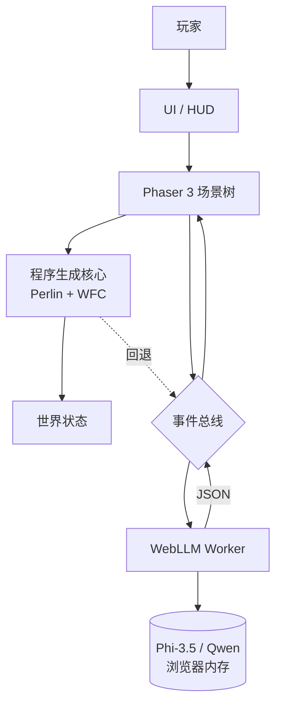

# Whimsy Shuffle 奇想洗牌世界 — 设计规格

> **For agentic workers:** REQUIRED SUB-SKILL: Use superpowers:subagent-driven-development (recommended) or superpowers:executing-plans to implement this plan task-by-task. Steps use checkbox (`- [ ]`) syntax for tracking.

> **语言说明:** 这是英文原版的中文翻译版,方便中文用户阅读。英文原版: [2026-06-20-whimsy-shuffle-design.md](./2026-06-20-whimsy-shuffle-design.md)

**目标:** 基于浏览器的 2D 沙盒休闲游戏,每一局都被"洗牌"——新主题、新关卡、新规则。技术栈: Phaser 3 + WebLLM。纯程序生成即可玩,LLM 加成可选开启。

**架构:** 双层设计。确定性程序生成核心 (Perlin + WFC) 构建世界。WebLLM 加成层(浏览器内、WebGPU)在之上添加惊喜与个性。全客户端,无服务器,无账号。

**技术栈:** Phaser 3 + TypeScript 5 + Vite 5 + WebLLM (浏览器端 LLM) + WebGPU。默认模型: Phi-3.5 mini 3.8B。可选: Qwen 2.5 7B(中文更优)。

**分支 / 仓库:** 沿用 "whimsy" 名字、同一个仓库,新项目路径 `projects/whimsy-shuffle/`。

**用途:** 个人学习 + 作品集项目。**不是**毕业设计、**不是**商业产品、**不是**社区维护项目。

---

## 1. 概述

**Whimsy Shuffle**(奇想洗牌世界)是一款基于浏览器的 2D 沙盒休闲游戏,世界本身是随机生成的。每一局游戏都被"洗牌"——新主题、新关卡、新规则、新惊喜。

游戏采用**双层架构**:
- **确定性程序生成层**(Perlin 噪声、Wave Function Collapse),无需任何 AI 即可构建世界。
- **AI 加成层**(浏览器内 WebLLM),在其上添加惊喜、个性与玩家驱动的变异。

### 它是什么
- 个人作品集 + 学习项目,展示浏览器内 LLM 集成。
- 2D 俯视角 Phaser 3 沙盒,每一局都有新鲜感。
- WebGPU 加速,完全客户端(无服务端)。
- "AI 作为调味料"的演示——程序生成是正餐,LLM 是香料。

### 它不是什么
- 不是商业产品。无变现、无商店上架、无 DRM。
- 不是毕业设计。无正式导师、无论文。
- 不是基于账号的游戏。无登录、无档案、无云存档。
- 不是依赖服务器的游戏。一切都在浏览器标签页内运行。
- 不是多人游戏。仅单人。
- 不是画面炫技。视觉风格刻意极简,让程序生成 / AI 惊喜成为主角。

---

## 2. 目标 & 非目标

### 目标
- 出一个静态部署的浏览器游戏,在普通桌面端浏览器单标签页可玩。
- 让 LLM **可选** —— 完整游戏循环不靠它也好玩。
- 让 LLM **可感知** —— 它参与时玩家能注意到("哦,这是生成的")。
- 覆盖普通硬件的玩家(默认模型目标 4-6 GB VRAM)。
- 代码库小到能一次读完(作品集读者的诉求)。
- 留在一个仓库,沿用 "whimsy" 名字,发布到 itch.io + GitHub Pages。

### 非目标(明确的"不要做")
- 不要加账号、身份验证或任何用户身份系统。
- 不要加服务器、数据库或任何持久后端。
- 不要加多人、联机或实时同步。
- 不要加埋点、分析或任何第三方跟踪。
- 不要加内购、广告或任何变现手段。
- 不要加移动 / 触屏版。仅鼠标 + 键盘。
- 不要在运行时依赖任何外部 API(OpenAI、Anthropic、Replicate 等)。
- 不要把 LLM 权重打进游戏 bundle。玩家浏览器在首次运行时从公开 WebLLM 兼容缓存(Hugging Face)拉取模型。
- 不要追求生产级 AI 安全过滤。生成文本沙盒作用域内、仅玩家可见。
- 不要承诺在集显上 60 FPS。目标在 RTX 3060 级硬件上 30-60 FPS。

---

## 3. 用户体验

### 3.1 首次加载(冷启动)

| 步骤 | 发生什么 | 时间预算(RTX 3060) |
|---|---|---|
| 1 | 页面加载,启动屏,"Whimsy Shuffle" 标题 + 副标题 | < 1s |
| 2 | 玩家选择模式:**纯程序生成** / **程序生成 + AI** | < 1s |
| 3 | 若选 AI 模式:WebLLM 开始下载模型 + 预热,显示进度条 | 30-90s |
| 4 | 游戏画布挂载,第一关程序生成(Perlin + WFC) | 1-3s |
| 5 | 玩家可立即开始游戏,模型加载在后台进行 | 并行 |
| 6 | 模型就绪,HUD 状态指示器显示 "AI ready" | — |

玩家在模型加载期间关闭标签页,无状态丢失。刷新后缓存复用(后续加载 <5s)。

### 3.2 典型一局(5 关,AI 模式)

| 阶段 | 玩家操作 | 系统响应 |
|---|---|---|
| 开始 | 点击 "New Shuffle"(新洗牌) | LLM 生成本局主题(1 次调用,~3-5s) |
| L1 | 走动、发现道具、与 NPC 对话(靠近时按 `E`) | LLM 按需生成 1-2 句台词(每次对话 1 次调用,~2-4s) |
| L1 结束 | 触碰到关卡出口 | 进入下一关(0 次 LLM 调用) |
| L2 | 把物理卡拖到当前关卡 | 重力 / 摩擦 / 弹性实时变化(0 次 LLM 调用;卡牌在生成卡组时已预烘焙) |
| L3 | 拖两张道具卡到融合祭坛 | 道具融合结果(1 次调用,~3-5s),需主动触发 |
| L4 | 自由游玩 | 无 LLM 活动;纯探索 |
| L5 结束 | 触碰到最终出口 | 本局总结,显示本局 LLM 调用总数 |

每局 LLM 调用:AI 模式下 **5-10 次**,纯程序生成模式下 **0 次**。**30-60s 总耗时**(RTX 3060)。

### 3.3 持续游玩

- 完成一局后,玩家可 "Reshuffle"(新主题+新关卡)或 "Continue"(保留主题,用新 WFC 种子重洗瓦片地图;主题卡牌保留)。
- 设置面板暴露:模型选择、每个机制 LLM 开关、重置模型缓存。
- 无存档槽。每局都是短暂存在的——乐趣在于洗牌本身。

### 3.4 回退 UX

- WebGPU 不可用:显示友好的 "你的浏览器不支持 WebGPU" 提示,默认进入**纯程序生成**模式。游戏仍完全可玩。
- 模型下载失败:停留在纯程序生成模式,HUD 显示一行提示。
- 某次 LLM 调用超时(>15s):取消,用程序生成回退,除"为速度跳过 AI"外不向用户记录任何信息。

---

## 4. 架构

### 4.1 分层

```
+--------------------------------------------------+
|  浏览器标签页 (静态 HTML / JS bundle)            |
|                                                  |
|  +-------------+    +-----------------------+    |
|  | Phaser 3    |    | WebLLM Worker         |    |
|  | 主线程      | <-> | (离线程, WebGPU)      |    |
|  | - 场景      |    | - Phi-3.5 / Qwen 2.5  |    |
|  | - 瓦片地图  |    | - 提示词模板          |    |
|  | - 物理      |    | - JSON 解析器         |    |
|  | - 实体      |    | - 回退处理器          |    |
|  +-------------+    +-----------------------+    |
|         ^                   ^                    |
|         |                   |                    |
|  +------|-------------------|----------------+   |
|  |      共享事件总线(类型化 pub/sub)         |   |
|  |      - 主线程: Phaser 3 内部 bus          |   |
|  |      - 主线程 <-> Worker: postMessage      |   |
|  |      - Worker 响应: MessageChannel         |   |
|  |      - Worker 内部: 自身 bus              |   |
|  +---------------------------------------------+  |
|         ^                                       |
|  +------|-------------------+                   |
|  | 程序生成核心            |                    |
|  | - Perlin 噪声生成器     |                    |
|  | - WFC 瓦片采样器        |                    |
|  | - 道具 / NPC 放置       |                    |
|  | - 物理规则注册表        |                    |
|  +--------------------------+                   |
+--------------------------------------------------+
        ^
        | (CDN 缓存: Hugging Face web-llm)
+--------------------------------------------------+
|  静态托管: itch.io / GitHub Pages / nginx         |
+--------------------------------------------------+
```

### 4.2 Mermaid 视图



### 4.3 线程模型
- **主线程**: Phaser 渲染 + 游戏循环、UI、输入。
- **Web Worker**: WebLLM 推理(离线程,隔离模型内存、避免卡帧)。
- **无 Service Worker**。缓存由浏览器标准 HTTP 缓存处理模型文件。

---

## 5. 核心机制

### 5.0 卡牌系统("洗牌"骨架)

整个游戏跑在**卡牌**之上。一局内每个交互元素——主题、物理扰动、道具、NPC、隐藏解锁——都是带固定 schema 的卡牌。LLM 的唯一职责是开局时**填充一局卡组**;之后,游戏完全客户端驱动,卡牌效果都是预烘焙的。

**为什么是卡牌,不是自由文本输入:**
- **输入有界。** 没有"想打什么打什么"——玩家出牌,永不生成原始文本。世界因此可控。
- **LLM 输出有界。** LLM 在严格 schema 内填卡牌槽位,不是自由 JSON,输出质量更高。
- **可组合。** 两张卡融合、道具+卡生成关卡、三张卡触发隐藏关。卡牌隐喻承载整个融合系统。
- **玩家熟悉。** "抽卡、出牌、融合"是常见机制(Slay the Spire、Inscryption、Balatro)。

**卡牌分类**(5 种,每局约 34-45 张):

| 类型 | 数量/局 | 来源(主 \| 程序生成回退) | 用途 |
|---|---|---|---|
| 主题 (Theme) | 1 | LLM \| 硬编码主题卡组(Phase 1) | 锁定整局调色板/命名/怪癖 |
| 物理 (Physics) | 8 | LLM \| 硬编码物理表(Phase 1) | 可出牌;改变当前关物理(**预烘焙**,出牌时无 LLM) |
| 道具 (Item) | 20-30 | LLM (5) + 程序生成 (15-25) | 可拾取;进物品栏 |
| 角色 (NPC) | 3 | LLM \| 固定对话表(Phase 1) | 定义 NPC 角色 + 性格 |
| 隐藏 (Hidden) | 2-3 | LLM \| 无(纯程序生成模式隐藏关不可触达) | 特定融合组合解锁隐藏关 |

**融合路径**(融合祭坛——所有路径都走祭坛;只有路径 1-3 触发 LLM):

| # | 输入 | 输出 | LLM 调用? | 隐藏关触发条件 |
|---|---|---|---|---|
| 1 | 道具 + 道具 | FusedItem | 是 | 永不 |
| 2 | 道具 + 物理卡 | FusedItem(吸收物理效果) | 是 | 仅当物理卡恰为匹配配方的隐藏卡(罕见) |
| 3 | 道具 + 隐藏卡 | HiddenLevel(或 FusedItem) | 是 | **总是**(配方匹配是定义) |
| 4 | 道具 + NPC 卡 | FusedItem(吸收角色提示) | 是 | 仅当 NPC 卡恰为匹配配方的隐藏卡(罕见) |
| 5 | 卡 + 卡 | ComposedItem(无 LLM) | 否 | 永不 |

示例:
- 路径 1: 藤鞭 + 盐水彗星 = 盐水鞭
- 路径 2: 箱子 + 月球卡 = 漂浮箱(持久效果)
- 路径 3: 箱子 + 盐水门卡 = 箱子世界(隐藏关)
- 路径 5: 月卡 + 海卡 = 潮汐卡(客户端组合)

**"洗牌"隐喻现在变成字面意义**: 每局 = 一副新洗好的牌。LLM 的工作缩为"构建一组协调的 30-40 张主题卡组"。

### 5.1 主题与卡组生成(每局开启,1 次调用)

新一局开始时,LLM 被要求在一次调用内构建整个卡组。这取代了旧的"仅主题"调用。

**LLM 输出示例(Phi-3.5)**:
```json
{
  "themeCard": {
    "name": "Cucumber Cosmos",
    "palette": ["#a8e6cf", "#dcedc1", "#ffd3b6", "#ffaaa5", "#ff8b94"],
    "ruleQuirk": "All liquids flow upward."
  },
  "itemCards": [
    { "name": "pickled star", "spriteKey": "orb_yellow", "behavior": "glows when held" },
    { "name": "brine comet", "spriteKey": "whip_blue", "behavior": "splashes on impact" },
    { "name": "vine whip", "spriteKey": "whip_red", "behavior": "extends 3 tiles" },
    { "name": "ferment orb", "spriteKey": "orb_green", "behavior": "slows nearby liquids" },
    { "name": "dill drone", "spriteKey": "shield_gold", "behavior": "follows player for 5s" }
  ],
  "physicsCards": [
    { "name": "Moon Bounce", "gravity": 200, "restitution": 0.95, "friction": 0.1 },
    { "name": "Heavy Brine", "gravity": 1400, "restitution": 0.1, "friction": 0.8 },
    { "name": "Icy Ground", "gravity": 800, "restitution": 0.2, "friction": 0.05 },
    { "name": "Sticky Vine", "gravity": 800, "restitution": 0.0, "friction": 1.5 }
  ],
  "npcCards": [
    { "role": "cosmic pickle vendor", "personality": "rambles about brine, friendly, cryptic" },
    { "role": "wandering brine sage", "personality": "speaks in questions, philosophical" },
    { "role": "vine keeper", "personality": "terse, protective of greenery" }
  ],
  "hiddenCards": [
    { "name": "Cucumber Memory", "unlockRecipe": ["vine whip", "ferment orb"] },
    { "name": "Brine Gate", "unlockRecipe": ["brine comet", "dill drone"] }
  ]
}
```

该 JSON 被 Phaser 读取,驱动视觉、填充世界、给 NPC 对话打标。

### 5.2 物理扰动(每关可选,出牌时 0 次 LLM 调用)

玩家打开**物理卡手牌**(从本局卡组抽,可在 HUD 查看),选一张,拖到当前关。卡牌效果在卡组生成时已**预烘焙**——无 LLM 调用、无文本输入、无歧义。

**示例**:
- 玩家手牌: `[Moon Bounce, Heavy Brine, Icy Ground, Sticky Vine]`
- 玩家把 `Moon Bounce` 拖到关卡。
- Phaser 物理引擎把 `gravity=200, restitution=0.95, friction=0.1` 打入当前关。
- HUD 显示: "Moon Bounce 生效 —— 关末恢复"

**可选 + 有界**: 玩家选卡,绝不输入。卡牌效果源自 LLM 卡组生成时(校验一次),不是自由文本。

### 5.3 道具融合(每关可选,每次融合 1 次 LLM 调用)

玩家拖两张卡到融合祭坛。五条融合路径(完整表见 §5.0;触达 LLM 的三条列于此处):

| 输入 | 输出 | LLM 调用? |
|---|---|---|
| 道具 + 道具 | 新 FusedItem | 是(调用) |
| 道具 + 物理卡 | 新 FusedItem(带持久效果) | 是(调用) |
| 道具 + 隐藏卡(匹配配方) | 隐藏关解锁 | 是(调用,关卡配方分支) |
| 道具 + NPC 卡 | 新 FusedItem(吸收角色提示) | 是(调用) |
| 卡 + 卡 | ComposedItem | 否(客户端 `composeCards(a, b)`,按现有卡牌统计可组合) |

**示例: 道具 + 道具(路径 1)**:
- 输入: `{ "a": "vine whip", "b": "brine comet" }`
- LLM 输出:
  ```json
  {
    "kind": "item",
    "name": "Brine Lash",
    "spriteKey": "whip_blue",
    "behavior": "extends and splashes on impact, freezing puddles",
    "stackable": false
  }
  ```

**示例: 道具 + 卡 = 隐藏关**:
- 输入: `{ "item": "Box", "card": "dill drone" }`
- LLM 输出:
  ```json
  {
    "levelName": "Box Drone World",
    "paletteOverride": ["#c4a484", "#8b6f47", "#5e4a2f"],
    "ruleQuirk": "Boxes are alive and chatty."
  }
  ```
- 玩家在本关结束后被传送到解锁的关卡。

**可选**: 需要明确拖到祭坛。无意外融合。

### 5.4 NPC 对话(模型加载后可用,每局 N 次调用)

每个 NPC 从**NPC 卡**(角色 + 性格)取值,该卡在卡组生成时产生。玩家靠近 NPC 按 `E` 时,LLM 生成 1-2 句入戏台词,可暗示隐藏卡牌配方或关卡秘密。纯程序生成模式下,固定对话表替代。

**示例**:
- NPC 卡: role = "cosmic pickle vendor",personality = "rambles about brine, friendly, cryptic"
- 玩家按 `E`。
- LLM 输出(WebLLM 支持时流式,否则整段返回): `"Ah, traveler! The brine runs thin near the eastern gate. I left a ferment orb there in '98. Or was it '99? Time pickles everything."`

**触发**: 在 NPC 1.5 瓦片内按 `E`。**无惊喜**——不自动弹出、不定时弹窗,触发永远是玩家动作。

**可用(模型加载后)**: 每次对话按 `E` 都生成新台词。无逐次 opt-in 开关。

### 5.5 隐藏关(由隐藏卡牌配方解锁,每次解锁 1 次调用)

卡组中的 2-3 张**隐藏卡**每张携带一个 `unlockRecipe`——一对特定的世界内道具。玩家融合该精确配对时,解锁一个隐藏关。

**示例**:
- 隐藏卡 "Cucumber Memory":配方 = `[vine whip, ferment orb]`
- 玩家把 `vine whip` + `ferment orb` 拖到祭坛。
- LLM 被调用生成该隐藏关的名字、调色板、规则怪癖。
- 该关卡被加入本局,在关卡选择中可触达。

**为什么这比旧的"找瓦片读文字"彩蛋更好:**
- 是发现 + 行动(融合)的组合——玩家有主动权。
- 奖励是关卡,不是一句话——可重玩,不是一次性。
- 隐藏卡牌配方被刻意设计得**几乎**像常见融合,玩家通过实验发现。

### 5.6 纯程序生成模式(默认模式,AI 需主动开启)

上述 5 个 LLM 机制**全部关闭**。世界、道具、NPC、规则、卡牌全由确定性 Perlin + WFC + 16 个硬编码主题(每个主题是一组手写卡牌;Phase 1 实现 5 个,Phase 3 扩展到 16 个)生成。对话变成固定模板字符串。隐藏关不可触达。

> **命名说明**:"默认 opt-out" 指该模式是默认状态;玩家需要主动 opt-out(切换到 AI 模式)才能开启 LLM。**不是**"默认关闭" 的反义。

---

## 6. 数据模型

### 6.1 Card(通用原子单元)

一局内所有交互内容都是卡牌。`type` 判别字段决定哪些 payload 字段被填充。

```ts
type CardType = "theme" | "physics" | "item" | "npc" | "hidden";

interface Card {
  id: string;                  // uuid
  type: CardType;
  name: string;                // 1-3 词
  // 类型特定 payload(只根据 type 填充一个):
  themePayload?: ThemePayload;
  physicsPayload?: PhysicsPayload;
  itemPayload?: ItemPayload;
  npcPayload?: NpcPayload;
  hiddenPayload?: HiddenPayload;
  generatedBy: "llm" | "fallback";
  generatedAt: number;         // epoch 毫秒
}

interface ThemePayload {
  palette: string[];           // 5 个 hex 颜色
  ruleQuirk: string;           // 1 句话
}

interface PhysicsPayload {
  gravity: number;             // 100-2000,默认 800
  restitution: number;         // 0-1,默认 0.3
  friction: number;            // 0-1.5,默认 0.5
  note: string;                // HUD 提示
}

interface ItemPayload {
  spriteKey: string;           // snake_case,来自精灵调色板
  behavior: string;            // 1 句,用于融合提示
  stackable: boolean;
  // 世界放置(卡组激活时分配,生成时不分配):
  spawnPool?: "common" | "rare";
}

interface NpcPayload {
  role: string;                // 2-4 词
  personality: string;         // 1 句提示词种子
}

interface HiddenPayload {
  unlockRecipe: [string, string]; // 一对道具名,被融合时解锁关卡
}
```

### 6.2 Deck(每局)
```ts
interface Deck {
  id: string;                  // uuid,与 session id 相同
  themeCard: Card;             // 1 张
  physicsCards: Card[];        // 8 张
  itemCards: Card[];           // 20-30 张
  npcCards: Card[];            // 3 张
  hiddenCards: Card[];         // 2-3 张
  generatedBy: "llm" | "fallback";
  generatedAt: number;
}
```

### 6.3 Level(关卡)
```ts
type Tile = 0 | 1 | 2 | 3 | 4;  // 0=地板,1=墙,2=水,3=草,4=花
type CardId = string;

interface Level {
  index: number;               // 0..4(+ 已解锁的隐藏关)
  deck: Deck;                  // 引用本局卡组
  tilemap: number[];           // WFC 瓦片索引数组,长度 = widthTiles * heightTiles
  widthTiles: number;          // 默认 64
  heightTiles: number;         // 默认 48
  spawnedItems: PlacedItem[];  // itemCards 放置到该关
  npcs: PlacedNpc[];           // npcCards 放置到该关
  activePhysicsCardId: string | null; // 引用 deck.physicsCards[i];由玩家设置
  exitTile: { x: number; y: number };
  unlockedByHiddenCardId?: string;    // 引用 deck.hiddenCards[i];仅当该关为隐藏关时设置
}

interface PlacedItem {
  cardId: string;              // 引用 deck.itemCards 中的 Card
  pos: { x: number; y: number };
}

interface PlacedNpc {
  cardId: string;              // 引用 deck.npcCards 中的 Card
  pos: { x: number; y: number };
  dialogueHistory: string[];   // 最近 3 句
}
```

### 6.4 FusedItem 与 ComposedItem(融合产物)

**FusedItem** —— 由 LLM 融合提示词产出(§5.0 中路径 1-4)。LLM 写入名称、sprite、行为。

```ts
interface FusedItem {
  id: string;
  name: string;
  spriteKey: string;
  behavior: string;
  stackable: boolean;
  fusedAt: number;             // epoch 毫秒
  fusedFrom: {
    type: "item+item" | "item+card";
    inputs: [CardId, CardId];  // 引用源卡
  };
}
```

**ComposedItem** —— 由客户端 `composeCards(a, b)` 函数产出(§5.0 中路径 5)。确定性,无 LLM 调用,结果查 `src/core/cardComposition.ts` 表。卡+卡永不产出 FusedItem。

```ts
interface ComposedItem {
  id: string;
  name: string;
  spriteKey: string;
  composedFrom: [CardId, CardId]; // 引用源卡
  composedAt: number;              // epoch 毫秒
}
```

**物品栏存储** —— FusedItem 与 ComposedItem 都进 `WorldState.inventory`,与原始 `Card` 道具共存(见 §6.6)。

### 6.5 HiddenLevel(由隐藏卡配方解锁)
```ts
interface HiddenLevel {
  id: string;
  name: string;
  paletteOverride: string[];   // 3-5 个 hex 颜色
  ruleQuirk: string;
  unlockRecipeCardId: string;  // 引用 deck.hiddenCards 中的 Card
}
```

### 6.6 WorldState(仅内存)
```ts
interface WorldState {
  deck: Deck | null;
  levels: Level[];             // 基础 5 关 + 任意已解锁隐藏关
  currentLevelIndex: number;
  activePhysicsCardId: string | null;  // 引用 deck.physicsCards[i];跨关卡切换保留
  inventory: (Card | FusedItem | ComposedItem)[]; // Card 条目必须 type === 'item'
  hand: Card[];                // 当前玩家手中的物理卡(deck.physicsCards 子集)
  unlockedHiddenLevelIds: string[]; // 引用 levels[] 中本局已解锁的隐藏关
  llmStats: {
    callsThisSession: number;
    totalLatencyMs: number;
    timeoutsThisSession: number;
  };
  mode: "procgen" | "ai";
  modelStatus: "unloaded" | "loading" | "ready" | "unavailable";
}
```

**为什么卡牌是一等公民:**
- 所有 schema 都引用 `Card`(或卡 id)——没有并行的 "Theme" 或 "PhysicsPatch" 类型。
- `Deck` 取代了旧的 `SessionTheme`。
- 融合祭坛把输入当作 `(Card | FusedItem, Card | FusedItem)`——类型统一。
- 程序生成回退可以产出一组完整可用的硬编码卡牌,完全不需要 LLM。

---

## 7. LLM 提示词设计

所有提示词适配 1024 token 上下文,输出单个 JSON 对象(或隐藏关的单字符串)。共用 `safeParseLLMJson(raw)` wrapper: trim、剥代码栅栏、尝试 `JSON.parse`、失败时剥尾随逗号、然后用"修复 JSON"续写提示重试一次,第二次失败则对该机制调用程序生成回退。

### 7.1 卡组生成(取代旧的主题生成)

这是单次最大的 LLM 调用。一次产出整局卡组。

```
SYSTEM: 你为一款异想天开的 2D 游戏世界构建一组协调的卡牌。始终以单个 JSON 对象回答。不要散文、不要 markdown、不要开场白。

USER: 构建一整副本局卡组。约束:
- 1 张主题卡: name(2-3 词),palette(恰好 5 个 hex 颜色,无重复),ruleQuirk(1 句,最多 12 词)
- 恰好 8 张物理卡: name(1-3 词),gravity(int 100-2000),restitution(float 0-1),friction(float 0-1.5),note(最多 8 词)
- 恰好 5 张道具卡(其余由程序生成池自动填充): name(1-3 词),spriteKey 选自集合 [whip_red, whip_blue, orb_green, orb_yellow, sword_cyan, sword_violet, shield_gold, potion_pink],behavior(1 句,最多 12 词),stackable(false)
- 恰好 3 张 NPC 卡: role(2-4 词),personality(1 句,最多 15 词)
- 恰好 2 张隐藏卡: name(2-3 词),unlockRecipe(一对来自 itemCards 的道具名)

所有卡牌须感觉同属一个世界。

JSON 形状:
{
  "themeCard": { "name": "...", "palette": ["#...", ...], "ruleQuirk": "..." },
  "physicsCards": [{ "name": "...", "gravity": <int>, "restitution": <float>, "friction": <float>, "note": "..." }, ...],
  "itemCards": [{ "name": "...", "spriteKey": "snake_case", "behavior": "...", "stackable": false }, ...],
  "npcCards": [{ "role": "...", "personality": "..." }, ...],
  "hiddenCards": [{ "name": "...", "unlockRecipe": ["item name A", "item name B"] }, ...]
}
```

### 7.2 物理扰动 —— 已移除

旧的"玩家输入短语"机制已删除。LLM 在卡组生成时已产出了 8 张物理卡;玩家只是出牌。扰动时无 LLM 调用。

### 7.3 道具融合(处理 3 条路径)

```
SYSTEM: 你把两个道具(或一个道具 + 一张卡)融合成新游戏道具,或解锁一个隐藏关。仅以单个 JSON 对象回答。不要散文、不要 markdown、不要开场白。

USER: 融合输入:
- A: {{INPUT_A_NAME}} — 类型: {{INPUT_A_TYPE}} — 行为: {{INPUT_A_BEHAVIOR}}
- B: {{INPUT_B_NAME}} — 类型: {{INPUT_B_TYPE}} — 行为: {{INPUT_B_BEHAVIOR}}

选对融合路径:
- 若 A 与 B 都是道具: 产出新 FusedItem。
- 若一边是道具、另一边是卡(物理/NPC/隐藏/主题): 产出吸收该卡效果的新 FusedItem;若该卡是匹配配方的隐藏卡,产出 HiddenLevel。
- 若有 unlockRecipe 匹配的隐藏卡在场: 产出 HiddenLevel。

JSON 形状(FusedItem):
{"kind": "item", "name": "...", "spriteKey": "snake_case from sprite palette", "behavior": "...", "stackable": false}

JSON 形状(HiddenLevel):
{"kind": "level", "levelName": "...", "paletteOverride": ["#...", ...], "ruleQuirk": "..."}

约束:
- FusedItem name: 1-3 词
- FusedItem behavior: 1 句,最多 15 词
- HiddenLevel ruleQuirk: 1 句,最多 12 词
```

### 7.4 NPC 对话
```
SYSTEM: 你扮演一个游戏 NPC。入戏、保持 1-2 句、不要开场白。

USER:
NPC 卡: {{NPC_CARD_JSON}}
  - role: {{NPC_ROLE}}
  - personality: {{NPC_PERSONALITY}}
世界主题: {{THEME_NAME}} — {{THEME_QUIRK}}
本世界的隐藏卡牌提示: {{HIDDEN_CARD_RECIPES_JSON}}   // 对话中可暗示配方
玩家刚: {{PLAYER_ACTION}} ("talked to me")
你最近说过的 3 句话: {{DIALOGUE_HISTORY_JSON}}

现在开口。避免和历史重复同样的开场。可以暗示隐藏卡牌配方,但绝不要把两个道具名同时直说。
```

### 7.5 隐藏关生成

由隐藏卡配方匹配触发。与融合路径 3(道具 + 隐藏卡)共用同一调用(在融合提示词中,当产出 `kind: "level"` 时处理)。无独立提示词。

### 7.6 卡 + 卡组合 —— 客户端处理(无 LLM)

卡 + 卡组合是确定性的,在客户端 `cardSystem.composeCards(a, b)` 中处理。无 LLM 调用。例: `Moon + Sea` 总是产出 `Tide`(一张带两者效果组合的卡)。组合表在 `src/core/cardComposition.ts`,手写维护。产出是 `ComposedItem`(不是 `FusedItem` —— 见 §6.4)。

### 7.7 输出解析
- 共用 `safeParseLLMJson(raw)` helper 处理 3 个 JSON 形状调用(卡组生成、道具融合、NPC 对话)。
- NPC 对话返回字符串(非 JSON)——用更简单的 `trim + 取首个非空行` 解析器。
- 任何第 2 次失败时,运行对应机制的程序生成回退(见 §5.6 和 §8.2)。

---

## 8. 性能预算

### 8.1 硬指标(RTX 3060,12GB VRAM,Chrome 稳定版)

| 阶段 | 目标 | 硬上限 |
|---|---|---|
| 冷页面加载到首帧 | < 2s | 5s |
| 首关程序生成 | < 3s | 6s |
| 模型下载(Phi-3.5,~2.3GB) | 60s | 120s |
| 模型预热(编译 + 首个 token) | 5s | 15s |
| 后续模型加载(已缓存) | < 3s | 8s |
| 主题 / 卡组生成 LLM 调用 | 5-8s | 15s 超时 |
| 道具融合 LLM 调用 | 3-5s | 12s 超时 |
| NPC 对话 LLM 调用 | 2-4s | 10s 超时 |
| 隐藏关解锁(每次命中融合) | 3-5s | 12s 超时 |
| 物理扰动(客户端,无 LLM) | < 16ms | 1 帧 |
| 每 5 关局 LLM 总耗时 | 30-60s | 90s |
| LLM 推理时帧率 | 30-60 FPS | 最低 20 FPS |
| 内存占用(JS 堆 + 模型) | < 6GB | 8GB |

### 8.2 回退链
1. WebGPU 不可用 -> 纯程序生成模式,UI 隐藏 AI 选项。
2. 模型下载失败 -> 纯程序生成模式,HUD 显示一次性提示。
3. LLM 调用超时 -> 取消,对该机制使用程序生成回退,`timeoutsThisSession` 统计 +1。
4. LLM 调用 1 次重试后仍返回畸形 JSON -> 程序生成回退,仅 console.log。
5. 浏览器标签页在游戏中后台化 -> 暂停模型,聚焦时恢复。

### 8.3 我们不优化什么
- 不追求单次 <2s。Phi-3.5 mini 在 RTX 3060 上产出 ~30-40 tok/s;200 token 响应天然要 5-7s。把提示词压到 ~150 token 以下会破坏输出质量。
- 不预打包模型。首次下载是浏览器内 AI 的代价,后续加载走浏览器 HTTP 缓存。

---

## 9. 项目结构

```
whimsy/
  docs/
    superpowers/
      specs/
        2026-06-20-whimsy-shuffle-design.md       <- 英文原版 spec
        2026-06-20-whimsy-shuffle-design.zh-CN.md <- 本文件
      plans/
        ...                                         <- 每阶段计划
  projects/
    whimsy-shuffle/
      README.md
      package.json
      tsconfig.json
      vite.config.ts                                <- 构建工具
      index.html
      public/
        sprites/                                    <- 全部 PNG / 精灵资源
          atlas/                                    <- Phaser 一次性 preload 的 atlas + json
            cards.png + cards.json
            items.png + items.json
            npcs.png + npcs.json
            tiles.png + tiles.json
          raw/                                      <- 打包前的单图(开发用)
            tiles/
            items/
            npcs/
            ui/
            vfx/
        sfx/                                       <- 短音效(预加载,<500KB 总)
          draw.wav
          place.wav
          fuse.wav
          reveal.wav
          hint.wav
          error.wav
        bgm/                                       <- 主题 BGM(懒加载,每主题 1 首)
          forest.ogg
          ocean.ogg
          dungeon.ogg
          scifi.ogg
          default.ogg
        favicon.ico
      src/
        main.ts                                     <- 入口
        config/
          model.ts                                  <- 模型注册表
          prompts.ts                                <- 提示词模板
          constants.ts
          assets.ts                                 <- asset manifest(URL + license + sha256)
        core/
          eventBus.ts                               <- 类型化 pub/sub
          worldState.ts                             <- WorldState 容器
          save.ts                                   <- 仅内存
          cardSystem.ts                             <- Card / Deck / Fusion 核心(不依赖 LLM)
          cardComposition.ts                        <- 卡+卡确定性合成表
        procgen/
          perlin.ts
          wfc.ts                                    <- Wave Function Collapse
          itemTable.ts                              <- 硬编码道具池
          deckFallback.ts                           <- 16 个硬编码卡组(每主题一个)
        phaser/
          scenes/
            BootScene.ts
            MenuScene.ts
            GameScene.ts
            HudScene.ts
            HandScene.ts                            <- 物理卡手牌视图
          entities/
            Player.ts
            Npc.ts
            ItemEntity.ts
            CardEntity.ts                           <- 地面上的卡牌(可拾取)
            FusionAltar.ts
          tilemap/
            levelLoader.ts
        llm/
          worker.ts                                 <- WebLLM Web Worker 入口
          modelLoader.ts                            <- 主线程代理
          prompts.ts                                <- 从 config 导入
          parsers.ts                                <- safeParseLLMJson
          callQueue.ts                              <- 序列化 + 超时
          fallback.ts                               <- 各机制程序生成回退
        ui/
          Hud.ts
          SettingsPanel.ts
          CardHandView.ts                           <- 玩家物理卡手牌
          FusionAltarUI.ts                          <- 拖两张卡融合
          Attribution.ts                            <- About 致谢 tab(TS,不是 TSX)
        utils/
          uuid.ts
          color.ts
          assetLoader.ts                           <- Phaser loader 包装(atlas/单图/SFX/BGM)
      tests/
        procgen/
        llm/
        cardSystem/                                 <- 卡组合、融合、隐藏关
        e2e/                                        <- Playwright
      benchmark/                                    <- 性能脚本
        measureLoad.ts
        measureInference.ts
```

---

## 10. 资产与资源库

### 10.1 选型原则

Whimsy Shuffle 是"AI 随机生成沙盒",每局主题、tile、风格都不同。**视觉一致性不重要**,**许可安全 + 来源稳定 + 资产量充足**才是关键。

| 原则 | 说明 |
|---|---|
| **许可优先 CC0** | 公共领域,免署名、免商用审查 |
| **备选 Royalty-Free** | NY Price 但允许商用 — 仅卡牌专项用 |
| **回避 GPL 系列** | 传染性许可,与商用发布冲突 |
| **回避 AI 生成图** | 训练数据来源不明,版权存疑 |
| **风格不统一 = 优势** | 每局从不同源选 tile / BGM,玩家感受不到"全是 Kenney 风" |

### 10.2 最优资产来源(分类映射)

| 资产类别 | 推荐来源 | 许可 | 备选 |
|---|---|---|---|
| **卡牌 frame / 卡背** | [cafeDraw Fantasy Card Assets](https://cafedraw.itch.io/fantasy-card-assets) | Royalty-Free | — |
| **卡牌 UI / 牌桌 / 动画** | [Praan Card Game 2D UI](https://praan.itch.io/cardgame2d) | Royalty-Free | — |
| **道具 sprite** | [Kenney](https://kenney.nl/assets) | CC0 | freegamesprites.com (CC0) |
| **NPC 角色** | Kenney 角色包 | CC0 | freegamesprites.com (CC0) |
| **主题 tile set** | OpenGameArt 主题包(逐个 license 审计) | CC0 / CC-BY | Kenney Platformer (CC0) |
| **粒子 / VFX** | Kenney Light Masks | CC0 | OpenGameArt particles (混合) |
| **UI 按钮 / 面板** | Kenney UI Pack + UI Expansion | CC0 | — |
| **SFX**(6 个核心) | [Mixkit Game SFX](https://mixkit.co/free-sound-effects/game/) | Mixkit License | Kenney Audio (CC0) / Pixabay (免署名) |
| **BGM**(主题 loop) | [Pixabay Music](https://pixabay.com/music/) | Pixabay License(免署名) | — |
| **英文字体** | [Inter](https://rsms.me/inter/) via Google Fonts | OFL 1.1 | — |
| **中文字体** | 系统 fallback(PingFang SC / 微软雅黑) | 系统 | — |
| **Phase 1 占位** | [phaserjs/examples](https://github.com/phaserjs/examples) `public/assets/` | MIT | — |

**与 §4 架构的关系**:itch.io 同时是部署目标和资产来源(cafeDraw / Praan / KayKit 都在 itch.io),GitHub Pages 和 nginx 不提供资产,只承载。

### 10.3 资源目录结构(§9 补充)

```
public/
  sprites/
    atlas/                                   <- Phaser 一次性 preload
      cards.json + cards.png                 <- 64×96 frame,16 列
      items.json + items.png                 <- 32×32 frame,32 列
      npcs.json + npcs.png                   <- 64×64 frame,16 列
      tiles.json + tiles.png                 <- 16×16 frame,32 列
    raw/                                     <- 打包前的单图(开发用)
      tiles/
      items/
      npcs/
      ui/
      vfx/
  sfx/                                       <- 短音效(预加载)
    draw.wav
    place.wav
    fuse.wav
    reveal.wav
    hint.wav
    error.wav
  bgm/                                       <- 主题 BGM(懒加载)
    forest.ogg
    ocean.ogg
    dungeon.ogg
    scifi.ogg
    default.ogg
  favicon.ico
src/
  config/
    assets.ts                                <- asset manifest(URL + license + sha256)
  core/
    assetLoader.ts                           <- Phaser loader 包装
  ui/
    Attribution.tsx                          <- About 致谢 tab
```

### 10.4 加载策略

| 策略 | 规则 |
|---|---|
| **atlas 一次性 preload** | BootScene 用 `this.load.atlas('cards', 'atlas/cards.png', 'atlas/cards.json')` 单 atlas 加载,避免 100 个单图请求 |
| **分主题懒加载** | GameScene.start 时按 selectedTheme 加载对应 tile + BGM |
| **BGM 按需** | 首次进入主题关才 fetch `bgm/{theme}.ogg`,避免 16 主题 × 3MB 全阻塞首屏 |
| **SFX 全量预加载** | 6 个 SFX 总 <500KB,BootScene 一次性 preload |
| **字体非阻塞** | `<link rel="preload" as="style" href="Inter">` + `font-display: swap`,首屏用 fallback |
| **HTTP 缓存** | Vite 产 `[hash].[ext]`,`Cache-Control: public, max-age=31536000, immutable` |

### 10.5 License 致谢(About 页必填)

About 模态框"致谢"tab 必须列出每个来源。

| 来源 | 许可 | 署名要求 |
|---|---|---|
| Kenney | CC0 | 否 |
| freegamesprites.com | CC0 | 否 |
| cafeDraw Fantasy Card | Royalty-Free | 是(可选) |
| Praan Card Game 2D UI | Royalty-Free | 是(可选) |
| Mixkit SFX | Mixkit License | 是(About 链接) |
| Pixabay Music/SFX | Pixabay License | 否(强烈推荐) |
| OpenGameArt 主题 tile | CC0 / CC-BY | 视具体包 |
| Phaser examples | MIT | 否 |
| Inter 字体 | OFL 1.1 | 否 |

**实现位置**:`src/ui/Attribution.ts`(TS,不是 TSX——本项目不用 React)。由游戏内 About 模态框的"致谢" tab 渲染。

### 10.6 卡牌视觉与资产映射

| 卡牌类型 | 视觉组成 |
|---|---|
| `themeCard` | atlas/cards.png 切 frame + Phaser tint 着色(主题色索引 0-4) |
| `physicsCard` | 卡背通用图 + icon 取自 atlas/items.png |
| `itemCard` | atlas/items.png 对应 sprite + 卡牌 frame |
| `npcCard` | atlas/npcs.png 对应 sprite + 卡牌 frame |
| `hiddenCard` | 卡背金光特效(粒子) + 隐藏 icon |

**关键设计**:LLM 生成的"卡牌名称/描述"只显示在卡牌正面文字栏,**不映射到 sprite**。sprite 是预烘焙的有限池,LLM 只能从已存在的 sprite 中挑选。这避免了"LLM 输出 dragon 卡,我们没 dragon sprite"的尴尬。

### 10.7 明确不做的

- **不**使用 AI 生成的图片(SD / DALL-E / Midjourney),训练数据来源不明
- **不**自己绘制像素艺术(非核心价值,耗时长)
- **不**购买商业 sprite pack(预算 0)
- **不**做 sprite 换色变体(用 Phaser tint 运行时调色,0 资产成本)
- **不**做 3D 模型(2D 沙盒定位)
- **不**使用 GPL 许可的资产(传染性与商用发布冲突)

### 10.8 资产 Pipeline 任务(横跨所有 Phase)

| 任务 | Phase | 描述 | 资产量 |
|---|---|---|---|
| Asset manifest | 1 | `src/config/assets.ts` 列出所有 URL + license + sha256 | — |
| 下载核心包 | 1 | Kenney UI Pack + cafeDraw 卡牌 + Mixkit 6 SFX + Phaser examples 占位 | ~3MB |
| Sprite atlas 打包 | 1 | `free-tex-packer` 打成 atlas + JSON | ~6MB |
| assetLoader.ts | 1 | Phaser loader 包装,支持 atlas / 单图 / SFX / BGM 四种 type | — |
| 占位 sprite 替换 | 1 | Phaser examples `dude/star/bomb` 换 Kenney 角色 + 道具 | — |
| Attribution 页 | 1 | About modal 加 "致谢" tab,渲染 §10.5 表格 | — |
| SFX 接入 | 2 | 6 个 SFX 接入 eventBus,play 触发 | — |
| 主题 tile + BGM | 2 | OpenGameArt 选 4-6 个主题 pack + Pixabay 配 BGM,按需加载 | ~10MB |
| lazy BGM 加载 | 2 | `bgm/{theme}.ogg` 按需 fetch + loading 状态 | — |
| 主题变体扩展 | 3 | 16 主题全部映射到 tile + BGM | ~20MB |

---

## 11. 实施阶段

### Phase 1 — 纯程序生成(无 LLM,无 WebGPU 要求)
**目标**: 完全可玩、有趣的沙盒,零 AI 依赖。卡组由 16 个硬编码主题包构建。所有卡牌机制无需 LLM 即可运行。

| 任务 | 描述 | 完成标准 |
|---|---|---|
| 1.1 | Vite + Phaser 3 + TypeScript 脚手架,浏览器可启动 | `npm run dev` 出现黑色画布 |
| 1.2 | Perlin 噪声地形生成 + 瓦片渲染 | 可走、可见的地形 |
| 1.3 | 玩家控制器(俯视角,WASD + 鼠标瞄准) | 玩家可移动、与墙碰撞 |
| 1.4 | WFC 瓦片采样器,用于生物群系 + 装饰 | 5 种不同的生物群系变体 |
| 1.5 | Card 数据模型 + Deck 容器 + 5 个硬编码卡组(每生物群系 1 个;Phase 3 扩展到 16) | 所有卡牌类型能通过 `Card` 接口 round-trip |
| 1.6 | CardEntity(地面卡牌) + 拾取 + 物品栏(最多 6 槽) | 拾起卡牌,HUD 可见 |
| 1.7 | NPC 实体 + 接近提示 + 固定对话表 | 与 NPC 对话,看到模板台词 |
| 1.8 | 关卡出口触发器 + 5 关局循环 | 端到端打通 5 关 |
| 1.9 | CardHandView: HUD 显示物理卡手牌,拖到关卡生效 | 拖 Moon Bounce 卡到关卡,物理变化 |
| 1.10 | FusionAltarUI: 拖两张道具卡,得到手写融合道具 | 拖藤鞭+盐水彗星 -> Brine Lash |
| 1.11 | 隐藏卡配方校验: 匹配对解锁硬编码隐藏关 | 融合匹配对,新关卡出现在关卡选择 |
| 1.12 | 设置面板: 模式切换(本阶段锁在 "procgen") | UI 可用 |
| 1.13 | 静态部署到 GitHub Pages | 从 `https://...github.io/...` 加载游戏 |

**Phase 1 的 LLM 调用: 0。** Phase 1 结束时游戏即可发布。

### Phase 2 — LLM 卡组生成(AI 可选,1 个机制)
**目标**: 通过一次调用生成整副卡组,端到端验证 WebLLM 集成。取代 16 个硬编码卡组,改为 LLM 编写。

| 任务 | 描述 | 完成标准 |
|---|---|---|
| 2.1 | 添加 WebLLM 依赖,创建 Web Worker 脚手架 | Worker 启动,模型 URL 配置 |
| 2.2 | 模型加载器: 下载 + 预热 + HUD 进度事件 | 下载时进度条显示 |
| 2.3 | 卡组生成提示词模板 + JSON 解析器 + 卡组回退 | 首个成功卡组被解析;回退路径已测试 |
| 2.4 | 卡组数据流入 Phaser: 主题调色板重染、卡牌名、NPC 角色 | 世界随每局可见地变化 |
| 2.5 | 设置面板: 模型选择(默认 Phi-3.5、可选 Qwen 2.5) | 玩家可切换模型 |
| 2.6 | 优雅降级: WebGPU 缺失 -> 隐藏 AI 选项,留在 procgen | 在非 WebGPU 浏览器测试 |
| 2.7 | 模型缓存复用: 第二次加载 <5s | 刷新后测试 |

**Phase 2 每局 LLM 调用: 1**(卡组生成)。总耗时: 5-8s(RTX 3060,输出比旧主题调用更大)。

### Phase 3 — 全 AI 加成(融合 + 对话 + 隐藏)
**目标**: 剩余 LLM 驱动机制连通。卡手牌与物理扰动已是客户端逻辑;剩余的 LLM 工作只有道具融合、NPC 对话、隐藏关生成。

| 任务 | 描述 | 完成标准 |
|---|---|---|
| 3.1 | 道具融合: 扩展融合祭坛,调用 LLM,解析 FusedItem 或 HiddenLevel | 融合藤鞭+盐水彗星 -> LLM 生成 Brine Lash |
| 3.2 | 隐藏关解锁: LLM 生成解锁关卡的调色板 + 怪癖 | 解锁 Box World,关卡以新视觉风格加载 |
| 3.3 | NPC 对话: 固定表替换为 LLM 生成,带历史上下文 | 对话 NPC,得到独特的 1-2 句 |
| 3.4 | 隐藏配方暗示进入 NPC 对话: NPC 可暗示配方道具 | 与对的 NPC 对话,得到隐藏配方的线索 |
| 3.5 | 调用队列: 串行化 LLM 调用、强制超时、统计递增 | 无并发调用,都尊重预算 |
| 3.6 | 各机制回退: 每个机制都有程序生成回退路径 | 游戏中禁用模型,游戏仍可继续 |
| 3.7 | 端到端性能测试: 5 关局,LLM 开,测总耗时 | < 90s(RTX 3060) |
| 3.8 | 跨浏览器冒烟: Chrome stable、Edge stable | 都能加载与游玩 |
| 3.9 | 部署到 itch.io | 公开页面上线 |

**Phase 3 每局 LLM 调用: 5-10。** 总耗时: 30-60s(RTX 3060)。

---

## 12. 成功标准

### Phase 1 完成意味着
- 新玩家可在 5 分钟内加载页面、玩一局 5 关。
- 每次 "Reshuffle" 产生视觉上不同的卡组(主题调色板、卡牌名、NPC 角色、物理效果)。
- 玩家可拖物理卡到关卡,看到物理实时变化,无 LLM 调用。
- 玩家可在融合祭坛融合两张道具卡,看到新道具出现。
- 玩家可融合隐藏卡配方对,解锁隐藏关。
- 游戏在 RTX 3060 无模型加载时跑 30+ FPS。
- 代码库能装进一个开发者脑子里(~2500 行游戏代码,含卡牌系统)。
- 静态部署工作: 打开 URL、立即玩、无 console 错误。
- 作品集读者可 clone、`npm install`、`npm run dev`、2 分钟内开始玩。

### Phase 2 完成意味着
- 选 "Procgen + AI" 的玩家在首次运行时看到模型下载进度条。
- 模型就绪后,新一局的卡组主题调色板反映在游戏中瓦片、道具、NPC 上。
- 卡组是协调的主题卡 + 8 张物理卡 + 5 张 LLM 写道具卡 + 3 张 NPC 卡 + 2 张隐藏卡,全部经 schema 校验、无垃圾。
- 玩家在模型加载期间关闭标签页再回来,模型已缓存,加载 < 5s。
- 设置里的模式开关仍工作,"纯程序生成" 不触碰到任何模型代码路径。
- 端到端冒烟: AI 模式下,每局都有非空、合法的 `Deck` JSON。

### Phase 3 完成意味着
- 所有 LLM 驱动机制(道具融合 LLM 调用、NPC 对话、隐藏关生成)都可通过文档化的玩家动作触达。
- AI 模式下的 5 关局触发 5-10 次 LLM 调用,RTX 3060 上 30-60s。
- 游戏中禁用模型不崩溃,游戏继续用程序生成回退(融合 / 对话 / 隐藏关)。
- 没有 LLM 调用超过 15s 超时。超时在 1 帧内触发回退。
- LLM Worker 不阻塞主线程;推理时帧率保持 30+ FPS。
- 刷新后的第二局加载 < 5s,3s 内到达第一关。
- itch.io 页面已上线,`npm run build` 可复现构建。

---

## 13. 明确不在范围内

这是一款本地独立游戏。以下内容因与该核心形态相悖而不做:

| 关切 | 为何不做 | 替代做法 |
|---|---|---|
| 用户账号 | 本地游戏不需要身份 | 完全不要账号 |
| 云存档 | 设计上无后端 | 局是短暂存在的 |
| 多人 | 单人沙盒 | 不规划 |
| 商业变现 | 不是产品 | 免费,无付费 |
| 生产级安全过滤 | 沙盒内、玩家可见的文本 | 尽力而为的提示词约束 |
