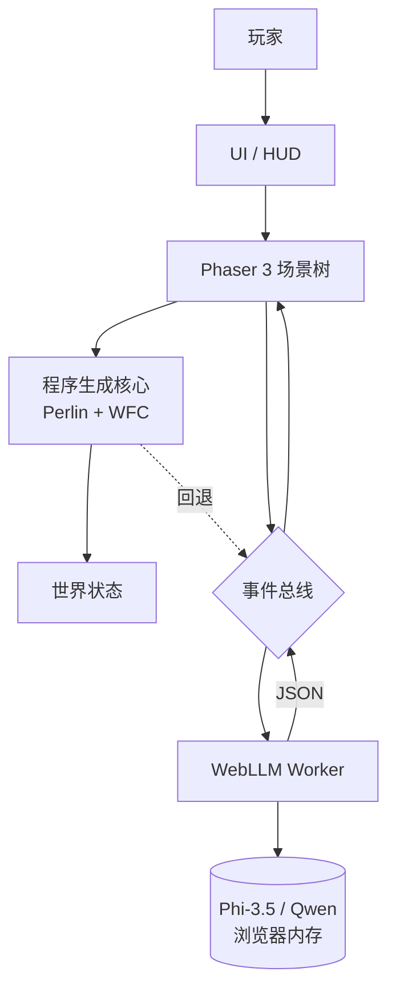

# Whimsy Shuffle 奇想洗牌世界 — 设计规格

> **For agentic workers:** REQUIRED SUB-SKILL: Use superpowers:subagent-driven-development (recommended) or superpowers:executing-plans to implement this plan task-by-task. Steps use checkbox (`- [ ]`) syntax for tracking.

> **语言说明:** 这是英文原版的中文翻译版,方便中文用户阅读。英文原版: [2026-06-20-whimsy-shuffle-design.md](./2026-06-20-whimsy-shuffle-design.md)

**目标:** 基于浏览器的 2D 沙盒休闲游戏,每一局都被"洗牌"——新主题、新关卡、新规则。技术栈: Phaser 3 + WebLLM。纯程序生成即可玩,LLM 加成可选开启。

**架构:** 双层设计。确定性程序生成核心 (Perlin + WFC) 构建世界。WebLLM 加成层(浏览器内、WebGPU)在之上添加惊喜与个性。全客户端,无服务器,无账号。

**技术栈:** Phaser 3 + TypeScript 5 + Vite 5 + WebLLM (浏览器端 LLM) + WebGPU。默认模型: Phi-3.5 mini 3.8B。可选: Qwen 2.5 7B(中文更优)。

**分支 / 仓库:** 沿用 "whimsy" 名字、同一个仓库,新项目路径 `projects/whimsy-shuffle/`。

**用途:** 个人学习 + 作品集项目。**不是**毕业设计、**不是**商业产品、**不是**社区维护项目。

---

## 1. 概述

**Whimsy Shuffle**(奇想洗牌世界)是一款基于浏览器的 2D 沙盒休闲游戏,世界本身是随机生成的。每一局游戏都被"洗牌"——新主题、新关卡、新规则、新惊喜。

游戏采用**双层架构**:
- **确定性程序生成层**(Perlin 噪声、Wave Function Collapse),无需任何 AI 即可构建世界。
- **AI 加成层**(浏览器内 WebLLM),在其上添加惊喜、个性与玩家驱动的变异。

### 它是什么
- 个人作品集 + 学习项目,展示浏览器内 LLM 集成。
- 2D 俯视角 Phaser 3 沙盒,每一局都有新鲜感。
- WebGPU 加速,完全客户端(无服务端)。
- "AI 作为调味料"的演示——程序生成是正餐,LLM 是香料。

### 它不是什么
- 不是商业产品。无变现、无商店上架、无 DRM。
- 不是毕业设计。无正式导师、无论文。
- 不是基于账号的游戏。无登录、无档案、无云存档。
- 不是依赖服务器的游戏。一切都在浏览器标签页内运行。
- 不是多人游戏。仅单人。
- 不是画面炫技。视觉风格刻意极简,让程序生成 / AI 惊喜成为主角。

---

## 2. 目标 & 非目标

### 目标
- 出一个静态部署的浏览器游戏,在普通桌面端浏览器单标签页可玩。
- 让 LLM **可选** —— 完整游戏循环不靠它也好玩。
- 让 LLM **可感知** —— 它参与时玩家能注意到("哦,这是生成的")。
- 覆盖普通硬件的玩家(默认模型目标 4-6 GB VRAM)。
- 代码库小到能一次读完(作品集读者的诉求)。
- 留在一个仓库,沿用 "whimsy" 名字,发布到 itch.io + GitHub Pages。

### 非目标(明确的"不要做")
- 不要加账号、身份验证或任何用户身份系统。
- 不要加服务器、数据库或任何持久后端。
- 不要加多人、联机或实时同步。
- 不要加埋点、分析或任何第三方跟踪。
- 不要加内购、广告或任何变现手段。
- 不要加移动 / 触屏版。仅鼠标 + 键盘。
- 不要在运行时依赖任何外部 API(OpenAI、Anthropic、Replicate 等)。
- 不要把 LLM 权重打进游戏 bundle。玩家浏览器在首次运行时从公开 WebLLM 兼容缓存(Hugging Face)拉取模型。
- 不要追求生产级 AI 安全过滤。生成文本沙盒作用域内、仅玩家可见。
- 不要承诺在集显上 60 FPS。目标在 RTX 3060 级硬件上 30-60 FPS。

---

## 3. 用户体验

### 3.1 首次加载(冷启动)

| 步骤 | 发生什么 | 时间预算(RTX 3060) |
|---|---|---|
| 1 | 页面加载,启动屏,"Whimsy Shuffle" 标题 + 副标题 | < 1s |
| 2 | 玩家选择模式:**纯程序生成** / **程序生成 + AI** | < 1s |
| 3 | 若选 AI 模式:WebLLM 开始下载模型 + 预热,显示进度条 | 30-90s |
| 4 | 游戏画布挂载,第一关程序生成(Perlin + WFC) | 1-3s |
| 5 | 玩家可立即开始游戏,模型加载在后台进行 | 并行 |
| 6 | 模型就绪,HUD 状态指示器显示 "AI ready" | — |

玩家在模型加载期间关闭标签页,无状态丢失。刷新后缓存复用(后续加载 <5s)。

### 3.2 典型一局(5 关,AI 模式)

| 阶段 | 玩家操作 | 系统响应 |
|---|---|---|
| 开始 | 点击 "New Shuffle"(新洗牌) | LLM 生成本局主题(1 次调用,~3-5s) |
| L1 | 走动、发现道具、与 NPC 对话 | LLM 生成的 NPC 对话流式出现 |
| L1 结束 | 触碰到关卡出口 | 生成该关的隐藏彩蛋(1 次调用,~2-3s) |
| L2 | 打开物理扰动面板,输入 "spicy" | 该关物理规则变异(1 次调用,~3-5s) |
| L3 | 拖两个道具到融合祭坛 | 道具融合结果(1 次调用,~3-5s),需主动触发 |
| L4 | 自由游玩 | 可选 LLM 惊喜时刻 |
| L5 结束 | 触碰到最终出口 | 本局总结,显示本局 LLM 调用总数 |

每局 LLM 调用:**5-10 次**、**30-60s 总耗时**(RTX 3060)。

### 3.3 持续游玩

- 完成一局后,玩家可 "Reshuffle"(新主题+新关卡)或 "Continue"(保留主题、新关卡)。
- 设置面板暴露:模型选择、每个机制 LLM 开关、重置模型缓存。
- 无存档槽。每局都是短暂存在的——乐趣在于洗牌本身。

### 3.4 回退 UX

- WebGPU 不可用:显示友好的 "你的浏览器不支持 WebGPU" 提示,默认进入**纯程序生成**模式。游戏仍完全可玩。
- 模型下载失败:停留在纯程序生成模式,HUD 显示一行提示。
- 某次 LLM 调用超时(>15s):取消,用程序生成回退,除"AI skipped for speed"外不向用户记录任何信息。

---

## 4. 架构

### 4.1 分层

```
+--------------------------------------------------+
|  浏览器标签页 (静态 HTML / JS bundle)            |
|                                                  |
|  +-------------+    +-----------------------+    |
|  | Phaser 3    |    | WebLLM Worker         |    |
|  | 主线程      | <-> | (离线程, WebGPU)      |    |
|  | - 场景      |    | - Phi-3.5 / Qwen 2.5  |    |
|  | - 瓦片地图  |    | - 提示词模板          |    |
|  | - 物理      |    | - JSON 解析器         |    |
|  | - 实体      |    | - 回退处理器          |    |
|  +-------------+    +-----------------------+    |
|         ^                   ^                    |
|         |                   |                    |
|  +------|-------------------|----------------+   |
|  |      共享事件总线 (window CustomEvent)      |   |
|  +-------------------------------------------+   |
|         ^                                       |
|  +------|-------------------+                   |
|  | 程序生成核心            |                    |
|  | - Perlin 噪声生成器     |                    |
|  | - WFC 瓦片采样器        |                    |
|  | - 道具 / NPC 放置       |                    |
|  | - 物理规则注册表        |                    |
|  +--------------------------+                   |
+--------------------------------------------------+
        ^
        | (CDN 缓存: Hugging Face web-llm)
+--------------------------------------------------+
|  静态托管: itch.io / GitHub Pages / nginx         |
+--------------------------------------------------+
```

### 4.2 Mermaid 视图



### 4.3 线程模型
- **主线程**: Phaser 渲染 + 游戏循环、UI、输入。
- **Web Worker**: WebLLM 推理(离线程,隔离模型内存、避免卡帧)。
- **无 Service Worker**。缓存由浏览器标准 HTTP 缓存处理模型文件。

---

## 5. 核心机制

### 5.1 主题生成(每局开启,1 次调用)

新一局开始时,询问 LLM 创造一个连贯的"世界主题",驱动视觉风格、关卡风味、道具名、NPC 性格。

**给 LLM 的输入示例**(节选):
> "发明一个异想天开的世界主题。输出 JSON: 名字、调色板(5 个 hex)、5 个道具名、3 个 NPC 角色、1 条规则怪癖。"

**LLM 输出示例(Phi-3.5)**:
```json
{
  "name": "Cucumber Cosmos",
  "palette": ["#a8e6cf", "#dcedc1", "#ffd3b6", "#ffaaa5", "#ff8b94"],
  "itemNames": ["pickled star", "brine comet", "vine whip", "ferment orb", "dill drone"],
  "npcRoles": ["cosmic pickle vendor", "wandering brine sage", "vine keeper"],
  "ruleQuirk": "All liquids flow upward."
}
```

该 JSON 被 Phaser 读取后,重染瓦片、重命名 HUD 标签、给 NPC 对话提示打标。

### 5.2 物理扰动(每关可选,1 次调用)

玩家打开一个小输入框,输入 1-3 词的短语(如 "spicy"、"低重力"、"sticky")。LLM 把这个短语翻译成物理规则补丁,覆盖当前关的默认规则。

**示例**:
- 输入: `"moon bounce"`
- LLM 输出:
  ```json
  {
    "gravity": 200,
    "restitution": 0.95,
    "friction": 0.1,
    "note": "Bouncy moon rules active."
  }
  ```
- Phaser 物理引擎把这些值打入当前关。

**可选**: 玩家必须主动打开输入框。没有意外物理变化。

### 5.3 道具融合(每关可选,1 次调用)

玩家从物品栏拖两个道具到融合祭坛。LLM 被要求发明一个结合两者特征的新道具。

**示例**:
- 输入: `{ "a": "vine whip", "b": "brine comet" }`
- LLM 输出:
  ```json
  {
    "name": "Brine Lash",
    "sprite": "whip_blue",
    "behavior": "extends and splashes on impact, freezing puddles",
    "stackable": false
  }
  ```

**可选**: 需要明确拖到祭坛。

### 5.4 NPC 对话(模型加载后持续开启,N 次调用)

每个 NPC 都有一个由本局主题衍生的简短性格提示。玩家在 NPC 附近按"对话"时,LLM 生成 1-2 句入戏台词,可能含隐藏道具提示或关卡秘密提示。

**示例**:
- NPC: "cosmic pickle vendor"(性格: "话多、聊盐水、友善、稍带神秘")
- 玩家按对话。
- LLM 输出(流式): `"Ah, traveler! The brine runs thin near the eastern gate. I left a ferment orb there in '98. Or was it '99? Time pickles everything."`

**持续开启(模型加载后)**: 对话是世界的一部分,不是玩家动作。

### 5.5 隐藏彩蛋(每关开启,1 次调用)

关末,LLM 被要求发明一个简短的氛围"秘密"——一行文字,玩家探索到标记瓦片时发现。设计为诗意,而非谜题。

**示例**:
- LLM 输出: `"Under the third stone from the vine wall, a pickle remembers being a cucumber."`

彩蛋以浮动文字的形式在玩家走近标记时在世界中渲染。

### 5.6 纯程序生成模式(默认开启此模式时)

上述 5 个 LLM 机制**全部关闭**。世界、道具、NPC、规则全由确定性 Perlin + WFC + 硬编码道具表生成。对话变成固定模板字符串。主题是唯一的"局"元素,从 16 个硬编码主题中随机抽取。

---

## 6. 数据模型

### 6.1 SessionTheme(本局主题)
```ts
interface SessionTheme {
  id: string;                  // uuid
  name: string;                // "Cucumber Cosmos"
  palette: string[];           // 5 个 hex 颜色
  itemNames: string[];         // 5 个名字
  npcRoles: string[];          // 3 个角色
  ruleQuirk: string;           // 1 句话
  generatedBy: "llm" | "fallback";
  generatedAt: number;         // epoch 毫秒
}
```

### 6.2 Level(关卡)
```ts
interface Level {
  index: number;               // 0..4
  theme: SessionTheme;
  tilemap: string;             // 序列化的 WFC 输出
  widthTiles: number;          // 默认 64
  heightTiles: number;         // 默认 48
  items: Item[];
  npcs: NPC[];
  physicsPatch: PhysicsPatch | null;
  exitTile: { x: number; y: number };
  hiddenEgg: HiddenEgg | null;
}
```

### 6.3 Item(道具)
```ts
interface Item {
  id: string;
  name: string;
  spriteKey: string;
  behavior: string;            // 人可读,用于融合提示词上下文
  stackable: boolean;
  pos: { x: number; y: number };
  fusedFrom?: [string, string]; // 若由融合产生,记录原道具 id
}
```

### 6.4 NPC
```ts
interface NPC {
  id: string;
  role: string;                // "cosmic pickle vendor"
  personality: string;         // 1 句提示词种子
  pos: { x: number; y: number };
  dialogueHistory: string[];   // 最近 3 句,用于上下文窗口
}
```

### 6.5 PhysicsPatch(物理补丁)
```ts
interface PhysicsPatch {
  gravity?: number;            // 默认 800
  restitution?: number;        // 默认 0.3
  friction?: number;           // 默认 0.5
  note?: string;               // HUD 提示中显示
}
```

### 6.6 HiddenEgg(隐藏彩蛋)
```ts
interface HiddenEgg {
  triggerTile: { x: number; y: number };
  text: string;                // 1 句,诗意
}
```

### 6.7 WorldState(仅内存)
```ts
interface WorldState {
  session: SessionTheme | null;
  currentLevelIndex: number;
  levels: Level[];
  inventory: Item[];
  llmStats: {
    callsThisSession: number;
    totalLatencyMs: number;
    timeoutsThisSession: number;
  };
  mode: "procgen" | "ai";
  modelStatus: "unloaded" | "loading" | "ready" | "unavailable";
}
```

---

## 7. LLM 提示词设计

所有提示词设计为适配 1024 token 上下文、输出单个 JSON 对象。使用简单 `try/parse` 包装;解析失败触发一次重试,然后走程序生成回退。

### 7.1 主题生成
```
SYSTEM: 你发明异想天开的游戏世界主题。始终以单个 JSON 对象回答,不要散文、不要 markdown、不要开场白。

USER: 发明一个独特的异想天开的世界主题。约束:
- name: 2-3 个有画面的词
- palette: 恰好 5 个 hex 颜色,无重复
- itemNames: 恰好 5 个短奇幻道具名(每个 1-3 词)
- npcRoles: 恰好 3 个贴合主题的角色名
- ruleQuirk: 一条短规则怪癖(1 句,最多 12 词)

仅以 JSON 回答,匹配以下形状:
{"name": "...", "palette": ["#...", ...], "itemNames": ["...", ...], "npcRoles": ["...", ...], "ruleQuirk": "..."}
```

### 7.2 物理扰动
```
SYSTEM: 你把玩家短语翻译成 2D 平台跳跃物理补丁。仅以单个 JSON 对象回答。

USER: 玩家短语: "{{PLAYER_INPUT}}"

默认值(若未指定): gravity=800, restitution=0.3, friction=0.5, dragX=0.99。
为这个短语挑合理的数值。注: 1 句短句(最多 10 词)。

JSON 形状:
{"gravity": <int 100-2000>, "restitution": <float 0-1>, "friction": <float 0-1>, "note": "..."}
```

### 7.3 道具融合
```
SYSTEM: 你把两个奇幻道具融合成新道具。仅以单个 JSON 对象回答。

USER: 融合这两个道具:
A: {{ITEM_A_NAME}} — 行为: {{ITEM_A_BEHAVIOR}}
B: {{ITEM_B_NAME}} — 行为: {{ITEM_B_BEHAVIOR}}

约束:
- name: 1-3 词
- spriteKey: snake_case, 从以下调色板中选: [whip_red, whip_blue, orb_green, orb_yellow, sword_cyan, sword_violet, shield_gold, potion_pink]
- behavior: 1 句(最多 15 词)
- stackable: false

JSON 形状:
{"name": "...", "sprite": "snake_case", "behavior": "...", "stackable": false}
```

### 7.4 NPC 对话
```
SYSTEM: 你扮演一个游戏 NPC。入戏、保持 1-2 句、不要开场白。

USER:
NPC 角色: {{NPC_ROLE}}
NPC 性格: {{NPC_PERSONALITY}}
世界主题: {{THEME_NAME}} — {{THEME_QUIRK}}
玩家刚: {{PLAYER_ACTION}} ("talked to me")
你最近说过的 3 句话: {{DIALOGUE_HISTORY_JSON}}

现在开口。避免和历史重复同样的开场。
```

### 7.5 隐藏彩蛋
```
SYSTEM: 你写一句诗意的秘密,藏在一个 2D 游戏世界里。1 句、最多 18 词、不要开场白。

USER: 世界主题: {{THEME_NAME}} — {{THEME_QUIRK}}
关卡: 第 {{LEVEL_INDEX}} / 5 关
本关最近出现的道具: {{ITEM_NAMES}}

写一句氛围文字,玩家找到后只读一次。诗意,不是谜题。
仅以单字符串回答(不要 JSON)。
```

### 7.6 输出解析
- 共用一个 `safeParseLLMJson(raw)` helper: trim、剥代码栅栏、尝试 `JSON.parse`、失败时剥尾随逗号、然后用"修复 JSON"续写提示重试一次。第二次失败则对该机制调用程序生成回退。
- 4 个 JSON 形状的机制共用该 helper。隐藏彩蛋是纯文本,使用更简单的 trim+取首行。

---

## 8. 性能预算

### 8.1 硬指标(RTX 3060,12GB VRAM,Chrome 稳定版)

| 阶段 | 目标 | 硬上限 |
|---|---|---|
| 冷页面加载到首帧 | < 2s | 5s |
| 首关程序生成 | < 3s | 6s |
| 模型下载(Phi-3.5,~2.3GB) | 60s | 120s |
| 模型预热(编译 + 首个 token) | 5s | 15s |
| 后续模型加载(已缓存) | < 3s | 8s |
| 主题生成 LLM 调用 | 3-5s | 15s 超时 |
| 物理扰动 LLM 调用 | 3-5s | 12s 超时 |
| 道具融合 LLM 调用 | 3-5s | 12s 超时 |
| NPC 对话 LLM 调用 | 2-4s | 10s 超时 |
| 隐藏彩蛋 LLM 调用 | 2-3s | 10s 超时 |
| 每 5 关局 LLM 总耗时 | 30-60s | 90s |
| LLM 推理时帧率 | 30-60 FPS | 最低 20 FPS |
| 内存占用(JS 堆 + 模型) | < 6GB | 8GB |

### 8.2 回退链
1. WebGPU 不可用 -> 纯程序生成模式,UI 隐藏 AI 选项。
2. 模型下载失败 -> 纯程序生成模式,HUD 显示一次性提示。
3. LLM 调用超时 -> 取消,对该机制使用程序生成回退,`timeoutsThisSession` 统计 +1。
4. LLM 调用 1 次重试后仍返回畸形 JSON -> 程序生成回退,仅 console.log。
5. 浏览器标签页在游戏中后台化 -> 暂停模型,聚焦时恢复。

### 8.3 我们不优化什么
- 不追求单次 <2s。Phi-3.5 mini 在 RTX 3060 上产出 ~30-40 tok/s;200 token 响应天然要 5-7s。把提示词压到 ~150 token 以下会破坏输出质量。
- 不预打包模型。首次下载是浏览器内 AI 的代价,后续加载走浏览器 HTTP 缓存。

---

## 9. 项目结构

```
whimsy/
  docs/
    superpowers/
      specs/
        2026-06-20-whimsy-shuffle-design.md       <- 英文原版 spec
        2026-06-20-whimsy-shuffle-design.zh-CN.md <- 本文件
      plans/
        ...                                         <- 每阶段计划
  projects/
    whimsy-shuffle/
      README.md
      package.json
      tsconfig.json
      vite.config.ts                                <- 构建工具
      index.html
      public/
        sprites/                                    <- 全部 PNG / 精灵资源
          tiles/
          items/
          npcs/
          ui/
        favicon.ico
      src/
        main.ts                                     <- 入口
        config/
          model.ts                                  <- 模型注册表
          prompts.ts                                <- 提示词模板
          constants.ts
        core/
          eventBus.ts                               <- 类型化 pub/sub
          worldState.ts                             <- WorldState 容器
          save.ts                                   <- 仅内存
        procgen/
          perlin.ts
          wfc.ts                                    <- Wave Function Collapse
          itemTable.ts                              <- 硬编码道具池
          themeFallback.ts                          <- 16 个硬编码主题
        phaser/
          scenes/
            BootScene.ts
            MenuScene.ts
            GameScene.ts
            HudScene.ts
          entities/
            Player.ts
            Npc.ts
            ItemEntity.ts
            FusionAltar.ts
          tilemap/
            levelLoader.ts
        llm/
          worker.ts                                 <- WebLLM Web Worker 入口
          modelLoader.ts                            <- 主线程代理
          prompts.ts                                <- 从 config 导入
          parsers.ts                                <- safeParseLLMJson
          callQueue.ts                              <- 序列化 + 超时
          fallback.ts                               <- 各机制程序生成回退
        ui/
          Hud.ts
          SettingsPanel.ts
          PerturbationInput.ts
        utils/
          uuid.ts
          color.ts
      tests/
        procgen/
        llm/
        e2e/                                        <- Playwright
      benchmark/                                    <- 性能脚本
        measureLoad.ts
        measureInference.ts
```

---

## 10. 实施阶段

### Phase 1 — 纯程序生成(无 LLM,无 WebGPU 要求)
**目标**: 完全可玩、有趣的沙盒,零 AI 依赖。这是最低可发布产品。

| 任务 | 描述 | 完成标准 |
|---|---|---|
| 1.1 | Vite + Phaser 3 + TypeScript 脚手架,浏览器可启动 | `npm run dev` 出现黑色画布 |
| 1.2 | Perlin 噪声地形生成 + 瓦片渲染 | 可走、可见的地形 |
| 1.3 | 玩家控制器(俯视角,WASD + 鼠标瞄准) | 玩家可移动、与墙碰撞 |
| 1.4 | WFC 瓦片采样器,用于生物群系 + 装饰 | 5 种不同的生物群系变体 |
| 1.5 | 道具实体 + 拾取 + 物品栏(最多 6 槽) | 拾起、放下、HUD 可见 |
| 1.6 | NPC 实体 + 接近提示 + 固定对话表 | 与 NPC 对话,看到模板台词 |
| 1.7 | 关卡出口触发器 + 5 关局循环 | 端到端打通 5 关 |
| 1.8 | 16 个硬编码主题,局开始时随机选择 | 每局新主题 |
| 1.9 | 设置面板:模式切换(本阶段锁在 "procgen") | UI 可用 |
| 1.10 | 静态部署到 GitHub Pages | 从 `https://...github.io/...` 加载游戏 |

**Phase 1 的 LLM 调用: 0。** Phase 1 结束时游戏即可发布。

### Phase 2 — LLM 主题生成(AI 可选,1 个机制)
**目标**: 在一个机制上端到端验证 WebLLM 集成。主题生成是风险最低、可见度最高的选择。

| 任务 | 描述 | 完成标准 |
|---|---|---|
| 2.1 | 添加 WebLLM 依赖,创建 Web Worker 脚手架 | Worker 启动,模型 URL 配置 |
| 2.2 | 模型加载器: 下载 + 预热 + HUD 进度事件 | 下载时进度条显示 |
| 2.3 | 主题生成的提示词模板 + JSON 解析器 + 回退 | 首个成功的主题被解析 |
| 2.4 | 主题数据流入 Phaser: 调色板重染、道具改名、NPC 角色更新 | 世界随每局可见地变化 |
| 2.5 | 设置面板: 模型选择(默认 Phi-3.5、可选 Qwen 2.5) | 玩家可切换模型 |
| 2.6 | 优雅降级: WebGPU 缺失 -> 隐藏 AI 选项,留在 procgen | 在非 WebGPU 浏览器测试 |
| 2.7 | 模型缓存复用: 第二次加载 <5s | 刷新后测试 |

**Phase 2 每局 LLM 调用: 1**(主题生成)。总耗时: 3-5s(RTX 3060)。

### Phase 3 — 全 AI 加成(全部 4 个机制)
**目标**: 所有可选 + 持续开启的 LLM 机制连通,性能预算达标,回退可靠。

| 任务 | 描述 | 完成标准 |
|---|---|---|
| 3.1 | 物理扰动: 输入 UI + LLM 调用 + 实时补丁 + 关末恢复 | 输入 "moon bounce" -> 弹性物理 |
| 3.2 | 道具融合: 拖到祭坛 UI + LLM 调用 + 新道具进物品栏 | 融合 "vine whip" + "brine comet" -> "Brine Lash" |
| 3.3 | NPC 对话: 固定表替换为 LLM 生成,带历史上下文 | 对话 NPC,得到独特的 1-2 句 |
| 3.4 | 隐藏彩蛋: 每关标记 + LLM 一句 + 世界内浮动文字 | 找到彩蛋,读出文字 |
| 3.5 | 调用队列: 串行化 LLM 调用、强制超时、统计递增 | 无并发调用,都尊重预算 |
| 3.6 | 各机制回退: 每个机制都有程序生成回退路径 | 游戏中禁用模型,游戏仍可继续 |
| 3.7 | 端到端性能测试: 5 关局,LLM 开,测总耗时 | < 90s(RTX 3060) |
| 3.8 | 跨浏览器冒烟: Chrome stable、Edge stable | 都能加载与游玩 |
| 3.9 | 部署到 itch.io | 公开页面上线 |

**Phase 3 每局 LLM 调用: 5-10。** 总耗时: 30-60s(RTX 3060)。

---

## 11. 成功标准

### Phase 1 完成意味着
- 新玩家可在 5 分钟内加载页面、玩一局 5 关。
- 每次 "Reshuffle" 产生视觉上不同的主题(调色板、道具名、NPC 角色)。
- 游戏在 RTX 3060 无模型加载时跑 30+ FPS。
- 代码库能装进一个开发者脑子里(~2000 行游戏代码)。
- 静态部署工作: 打开 URL、立即玩、无 console 错误。
- 作品集读者可 clone、`npm install`、`npm run dev`、2 分钟内开始玩。

### Phase 2 完成意味着
- 选 "Procgen + AI" 的玩家在首次运行时看到模型下载进度条。
- 模型就绪后,新一局的主题调色板反映在游戏中瓦片、道具、NPC 上。
- 主题是连贯的名词短语 + 5 色 + 5 名字(经过 schema 校验,不是垃圾)。
- 玩家在模型加载期间关闭标签页再回来,模型已缓存,加载 < 5s。
- 设置里的模式开关仍工作,"纯程序生成" 不触碰到任何模型代码路径。
- 端到端冒烟: AI 模式下,每局都有非空、合法的 `SessionTheme` JSON。

### Phase 3 完成意味着
- 全部 4 个 LLM 机制都可通过文档化的玩家动作触达。
- AI 模式下的 5 关局触发 5-10 次 LLM 调用,RTX 3060 上 30-60s。
- 游戏中禁用模型不崩溃,游戏继续用程序生成回退。
- 没有 LLM 调用超过 15s 超时。超时在 1 帧内触发回退。
- LLM Worker 不阻塞主线程;推理时帧率保持 30+ FPS。
- 刷新后的第二局加载 < 5s,3s 内到达第一关。
- itch.io 页面已上线,`npm run build` 可复现构建。

---

## 12. 明确不在范围内

这是一款本地独立游戏。以下内容因与该核心形态相悖而不做:

| 关切 | 为何不做 | 替代做法 |
|---|---|---|
| 用户账号 | 本地游戏不需要身份 | 完全不要账号 |
| 云存档 | 设计上无后端 | 局是短暂存在的 |
| 多人 | 单人沙盒 | 不规划 |
| 商业变现 | 不是产品 | 免费,无付费 |
| 生产级安全过滤 | 沙盒内、玩家可见的文本 | 尽力而为的提示词约束 |
